erDiagram
    users ||--o{ orders : "places"
    users ||--o{ reviews : "writes"
    categories ||--o{ products : "contains"
    products ||--o{ order_items : "included_in"
    products ||--o{ reviews : "receives"
    products ||--o{ inventory_movements : "has"
    products ||--o{ product_price_history : "tracks"
    orders ||--o{ order_items : "contains"
    orders ||--|| payments : "has"
    orders ||--|| shipments : "has"
    coupons ||--o{ orders : "applied_to"

    users {
        int id PK
        string email
        string password_hash
    }
    products {
        int id PK
        int category_id FK
        string name
        decimal price
        int stock
    }
    orders {
        int id PK
        int user_id FK
        int coupon_id FK
        decimal total_amount
        string status
    }

---------------------------------------------
**Soru 1: Her Kategoride En Çok Satan İlk 3 Ürün**

**SQL Sorgusu:**
```sql
WITH KategoriSatis AS (
    SELECT 
        c.name AS kategori_adi,
        p.name AS urun_adi,
        SUM(oi.quantity * oi.unit_price) AS toplam_gelir
    FROM categories c
    JOIN products p ON c.id = p.category_id
    JOIN order_items oi ON p.id = oi.product_id
    JOIN orders o ON oi.order_id = o.id
    WHERE o.status = 'completed'
    GROUP BY c.id, c.name, p.id, p.name
),
Siralama AS (
    SELECT 
        kategori_adi,
        urun_adi,
        toplam_gelir,
        ROW_NUMBER() OVER(PARTITION BY kategori_adi ORDER BY toplam_gelir DESC) as sira
    FROM KategoriSatis
)
SELECT 
    kategori_adi,
    sira,
    urun_adi,
    toplam_gelir
FROM Siralama
WHERE sira <= 3
ORDER BY kategori_adi, sira;
```
 **Sonuç:**
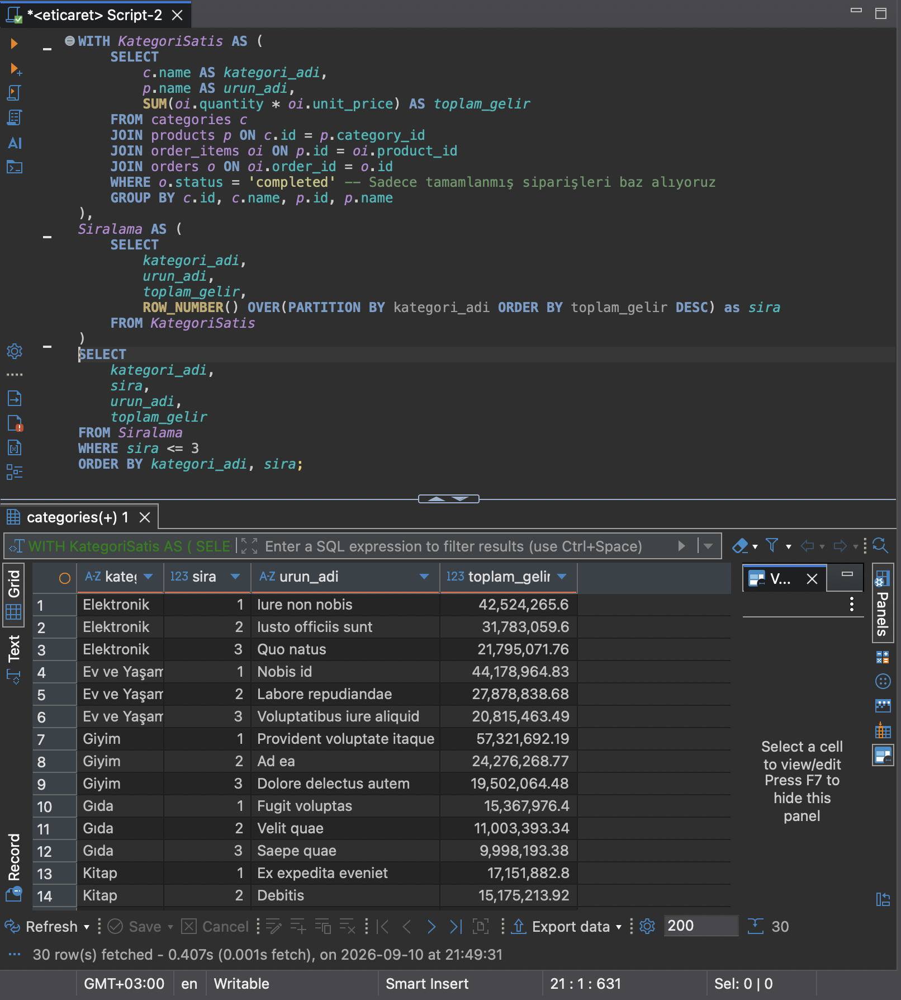

**İş Yorumu:**
ROW_NUMBER ve PARTITION BY analitik fonksiyonları kullanılarak oluşturulan bu sorgu, her bir kategorinin kendi içindeki en yüksek gelir getiren ilk 3 ürününü bağımsız olarak listeler. Kategori müdürleri ve e-ticaret yöneticileri, bu veriyi analiz ederek web sitesindeki ana sayfa vitrinlerini ve kategori sıralamalarını optimize edebilir, en çok ciro yaratan lokomotif ürünlerin stok takibini daha sıkı bir şekilde yürütebilirler.

---

**Soru 2: Aylık Büyüme Oranı (LAG Analizi)**

**SQL Sorgusu:**
```sql
WITH AylikCiro AS (
    SELECT
        DATE_TRUNC('month', created_at) AS ay,
        SUM(total_amount) AS ciro
    FROM orders
    WHERE status = 'completed'
    GROUP BY DATE_TRUNC('month', created_at)
),
AylikKiyaslama AS (
    SELECT
        ay,
        ciro,
        LAG(ciro) OVER(ORDER BY ay) AS onceki_ay_cirosu
    FROM AylikCiro
)
SELECT
    ay,
    ciro,
    onceki_ay_cirosu,
    ROUND(((ciro - onceki_ay_cirosu) / onceki_ay_cirosu) * 100, 2) AS buyume_orani_yuzde
FROM AylikKiyaslama
ORDER BY ay;
```
**Sonuç:**
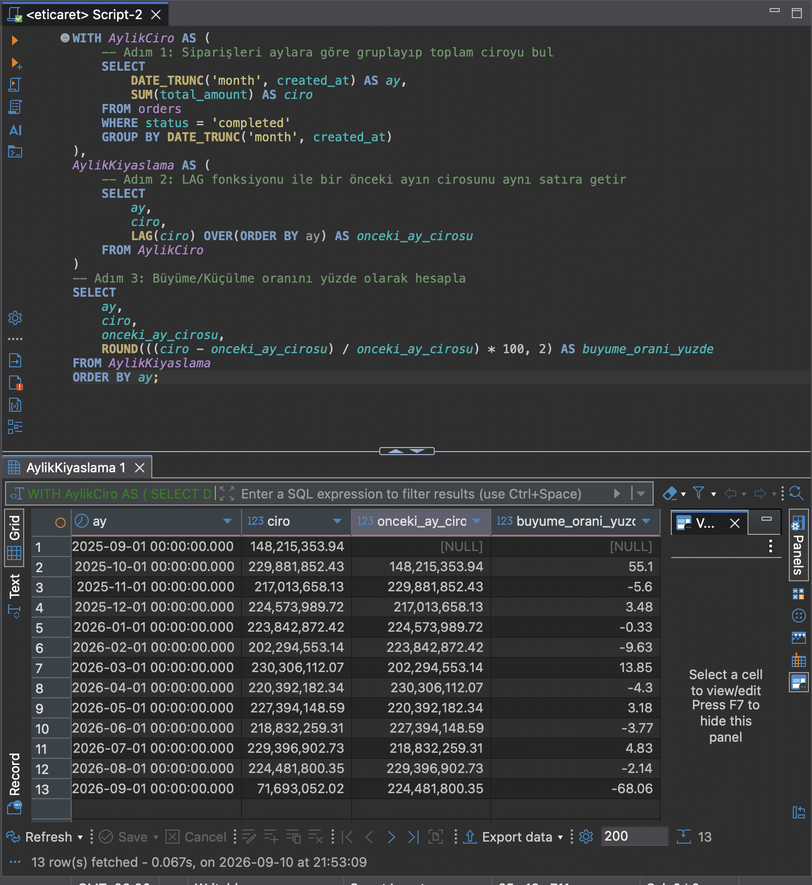
**İş Yorumu:**
Şirketin aydan aya (MoM) büyüme ivmesini ölçmek amacıyla LAG analitik fonksiyonu kullanılarak geçmiş ayın cirosu mevcut ayın yanına getirilmiş ve yüzdesel fark hesaplanmıştır. Bu kritik finansal metrik, yönetici ekibin platformun genel büyüme trendini şeffaf bir şekilde görmesini sağlar; ayrıca pazarlama kampanyalarının makro düzeydeki etkisini ve şirketin yıllık projeksiyon hedeflerine ulaşıp ulaşmadığını değerlendirmek için kullanılır.

---

**Soru 3: Müşteri RFM Segmentasyonu (NTILE ile)**

**SQL Sorgusu**
```sql
WITH RFM_Degerleri AS (
    SELECT 
        user_id,
        MAX(created_at) AS son_siparis_tarihi,
        COUNT(id) AS siparis_sayisi,
        SUM(total_amount) AS toplam_harcama
    FROM orders
    WHERE status = 'completed'
    GROUP BY user_id
),
RFM_Skorlari AS (
    SELECT 
        user_id,
        son_siparis_tarihi,
        siparis_sayisi,
        toplam_harcama,
        NTILE(4) OVER(ORDER BY son_siparis_tarihi ASC) AS r_skor, 
        NTILE(4) OVER(ORDER BY siparis_sayisi ASC) AS f_skor,
        NTILE(4) OVER(ORDER BY toplam_harcama ASC) AS m_skor
    FROM RFM_Degerleri
)
SELECT 
    user_id,
    r_skor,
    f_skor,
    m_skor,
    CONCAT(r_skor, f_skor, m_skor) AS rfm_kodu,
    CASE 
        WHEN r_skor = 4 AND f_skor = 4 AND m_skor = 4 THEN 'Sampiyonlar'
        WHEN r_skor >= 3 AND f_skor >= 3 THEN 'Sadik Musteriler'
        WHEN r_skor <= 2 AND f_skor >= 3 THEN 'Riskli (Kaybedilmek Uzere)'
        WHEN r_skor = 1 AND f_skor <= 2 THEN 'Kaybedilenler'
        ELSE 'Digerleri'
    END as segment
FROM RFM_Skorlari
ORDER BY rfm_kodu DESC;
```
**Sonuç:**
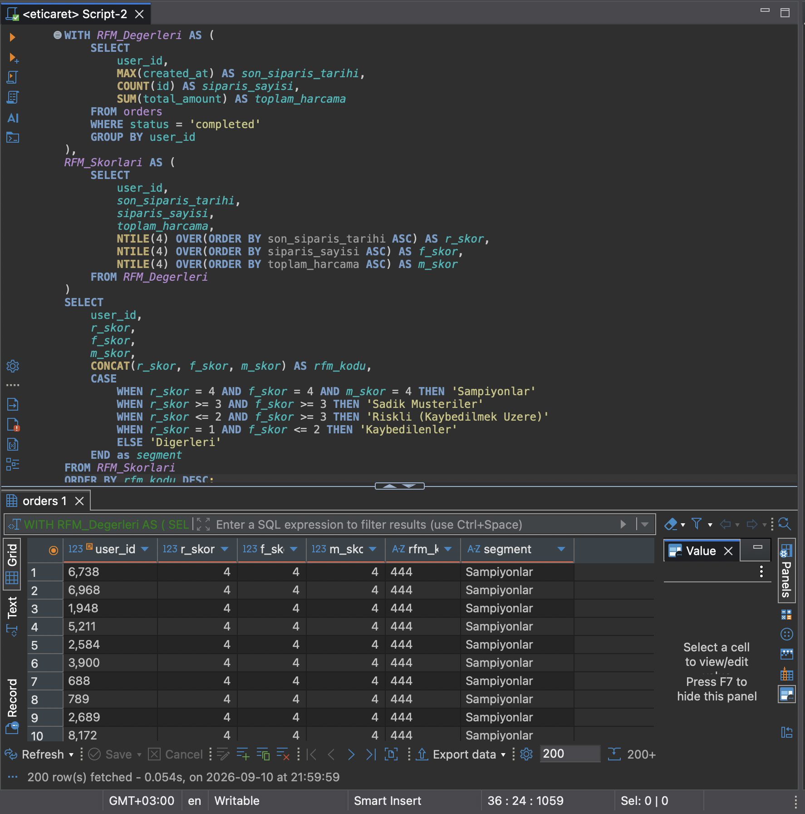

**İş Yorumu:**
Müşteriler; Güncellik (Recency), Sıklık (Frequency) ve Parasal Değer (Monetary) bazında NTILE(4) fonksiyonu ile dörttebirlik dilimlere ayrılarak otomatik bir segmentasyon sistemi kurulmuştur. Pazarlama ve CRM departmanları bu çıktıyı kullanarak "Şampiyonlar" segmentine özel sadakat programları (VIP ayrıcalıklar) sunabilir veya "Riskli" durumdaki yüksek potansiyelli müşterilere indirimli geri kazanım (retargeting) kampanyaları düzenleyerek müşteri yaşam boyu değerini (LTV) maksimize edebilirler.

---

**Soru 4: Ürün Başına 7 Günlük Hareketli Ortalama Satış**

**SQL Sorgusu**
```sql
WITH GunlukSatis AS (
    SELECT 
        product_id,
        DATE_TRUNC('day', o.created_at) AS satis_tarihi,
        SUM(oi.quantity) AS gunluk_adet
    FROM order_items oi
    JOIN orders o ON oi.order_id = o.id
    WHERE o.status = 'completed'
    GROUP BY product_id, DATE_TRUNC('day', o.created_at)
)
SELECT 
    product_id,
    satis_tarihi,
    gunluk_adet,
    ROUND(AVG(gunluk_adet) OVER(
        PARTITION BY product_id 
        ORDER BY satis_tarihi 
        ROWS BETWEEN 6 PRECEDING AND CURRENT ROW
    ), 2) AS yedi_gunluk_ort_satis
FROM GunlukSatis
ORDER BY product_id, satis_tarihi;
```

**Sonuç:**
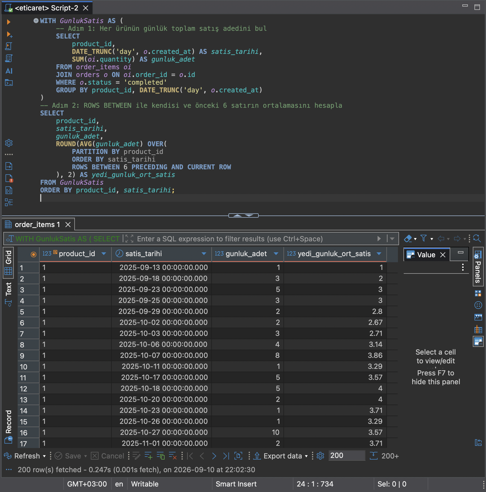

**İş Yorumu:**
Bu sorguda, ROWS BETWEEN 6 PRECEDING AND CURRENT ROW pencere fonksiyonu kullanılarak ürünlerin günlük satış adetlerindeki gürültü (noise) filtrelenmiş ve son 7 günün hareketli ortalaması (Rolling Average) hesaplanmıştır. Depo ve tedarik zinciri yöneticileri, hafta sonu veya kampanya günlerinde yaşanan ani dalgalanmalara aldanmadan ürünlerin gerçek talep eğilimini (trend) bu veriyle tespit eder; böylece stok tükenmelerinin (out-of-stock) önüne geçer ve envanter maliyetlerini optimize eder.

---

**Soru 5: Ardışık Günlerde Alışveriş Yapan Müşteri Serileri (Gaps and Islands Problemi)**

**SQL Sorgusu**
```sql
WITH DistinctDays AS (
    SELECT DISTINCT
        user_id,
        DATE_TRUNC('day', created_at) AS islem_gunu
    FROM orders
    WHERE status = 'completed'
),
GroupedDays AS (
    SELECT 
        user_id,
        islem_gunu,
        islem_gunu - (ROW_NUMBER() OVER(PARTITION BY user_id ORDER BY islem_gunu) * INTERVAL '1 day') AS island_group
    FROM DistinctDays
)
SELECT 
    user_id,
    MIN(islem_gunu) AS seri_baslangic_tarihi,
    MAX(islem_gunu) AS seri_bitis_tarihi,
    COUNT(*) AS ardisik_gun_sayisi
FROM GroupedDays
GROUP BY user_id, island_group
HAVING COUNT(*) > 1
ORDER BY ardisik_gun_sayisi DESC, seri_baslangic_tarihi DESC;
```
**Sonuç:**
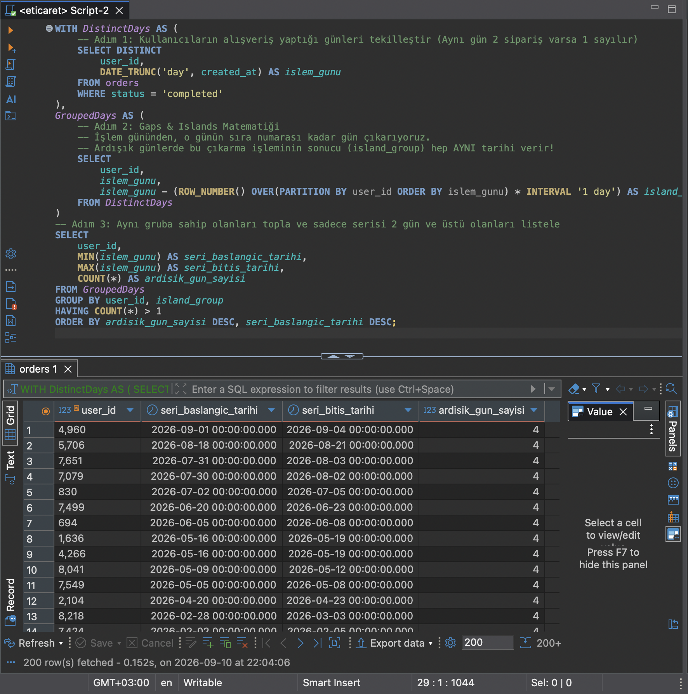
**İş Yorumu:**
Kullanıcıların platformda kesintisiz olarak kaç gün üst üste alışveriş yaptığını (streak) tespit etmek amacıyla klasik "Gaps and Islands" veri analizi tekniği uygulanmıştır. Ardışık günlerde alışveriş yapan bu kemik kitle, markaya en yüksek bağlılığı gösteren, bağımlılık seviyesi yüksek kullanıcılardır. Platform yöneticileri bu serileri tespit ederek oyunlaştırma (gamification) rozetleri verebilir ve kullanıcı alışkanlıklarını ödüllendirerek platformda kalma sürelerini kalıcı olarak uzatabilir.

---

**Soru 6: Funnel Dönüşüm Oranları (Sipariş -> Ödeme -> Kargo)**

**SQL Sorgusu:**
```sql
WITH Funnel_Verisi AS (
    SELECT
        COUNT(DISTINCT o.id) AS toplam_siparis,
        COUNT(DISTINCT p.order_id) AS odenen_siparis,
        COUNT(DISTINCT s.order_id) AS kargolanan_siparis
    FROM orders o
    LEFT JOIN payments p ON o.id = p.order_id AND p.status = 'success'
    LEFT JOIN shipments s ON o.id = s.order_id
)
SELECT 
    toplam_siparis,
    odenen_siparis,
    ROUND((odenen_siparis::numeric / NULLIF(toplam_siparis, 0)) * 100, 2) AS odeme_donusum_orani_yuzde,
    kargolanan_siparis,
    ROUND((kargolanan_siparis::numeric / NULLIF(odenen_siparis, 0)) * 100, 2) AS kargo_donusum_orani_yuzde
FROM Funnel_Verisi;
```

**Sonuç:**
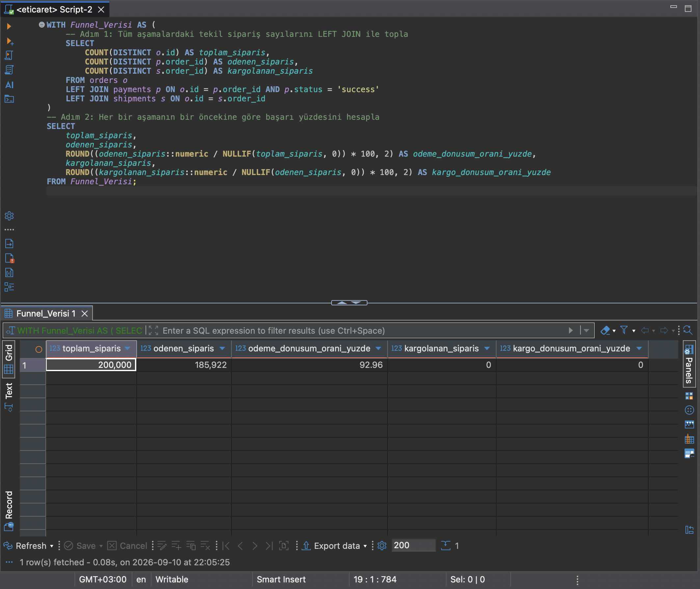

**İş Yorumu:**
Kullanıcıların satın alma yolculuğundaki (Customer Journey) darboğazları (bottlenecks) tespit etmek için huni (funnel) analizi yapılmıştır. Sepet aşamasından ödemeye, ödemeden kargolanma aşamasına geçerken yaşanan müşteri kayıpları yüzdesel olarak ölçülmüştür. Ürün yöneticileri bu veriyi kullanarak ödeme sayfasındaki olası teknik hataları veya kargo operasyonlarındaki aksaklıkları tespit edip, sepeti terk etme (abandoned cart) oranlarını düşürecek aksiyonlar alabilirler.

---

**Soru 7: En Çok Sipariş Veren 10 Müşteri (VIP Müşteriler)**

**SQL Sorgusu:**
```sql
SELECT
    u.email,
    COUNT(o.id) AS toplam_siparis_sayisi,
    SUM(o.total_amount) AS toplam_harcama
FROM users u
JOIN orders o ON u.id = o.user_id
WHERE o.status = 'completed'
GROUP BY u.id, u.email
ORDER BY toplam_siparis_sayisi DESC
LIMIT 10;
```

**Sonuç:**
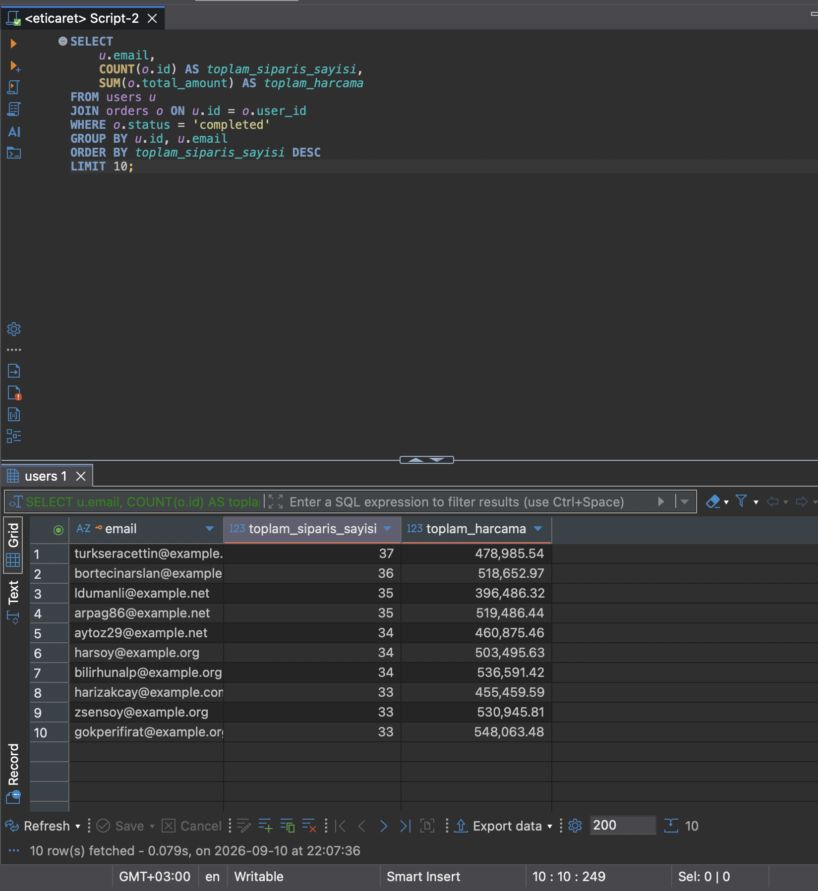

**İş Yorumu:**
Platformun en sık alışveriş yapan ve en sadık müşteri kitlesini (Top 10) belirlemek amacıyla sipariş sıklığına göre azalan bir sıralama yapılmıştır. Bu kullanıcılar, markanın en değerli elçileri olup, onlara özel doğum günü indirimleri, yeni ürünlere erken erişim hakkı veya sürpriz hediyeler sunularak marka sadakatleri kalıcı hale getirilebilir ve Ağızdan Ağıza Pazarlama (WOMM) etkisi yaratılabilir.

---

**Soru 8: Hiç Alışveriş Yapmayan Kullanıcılar (Pasif Üyeler)**

**SQL Sorgusu:**
```sql
SELECT
    u.email,
    u.created_at AS kayit_tarihi
FROM users u
LEFT JOIN orders o ON u.id = o.user_id
WHERE o.id IS NULL
ORDER BY u.created_at DESC
LIMIT 50;
```

**Sonuç:**
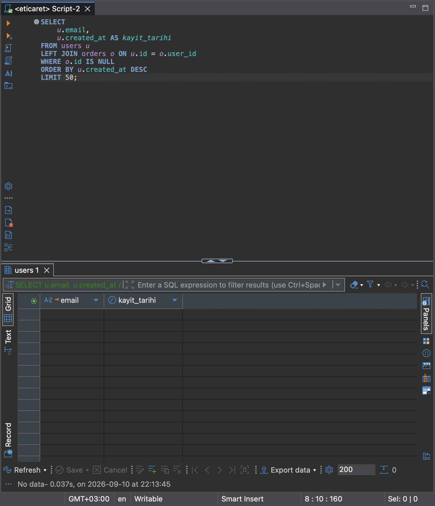

**İş Yorumu:**
Sisteme kayıt olmuş ancak henüz hiçbir sipariş oluşturmamış (aktivasyon sağlayamamış) pasif kullanıcılar tespit edilmiştir. Pazarlama departmanı, bu kullanıcıların listesini kullanarak onlara "Hoş Geldin İndirimi", "İlk Siparişe Özel Ücretsiz Kargo" gibi teşvik edici "Buz Kırıcı" (Icebreaker) e-posta veya SMS kampanyaları düzenleyerek onları aktif müşteri havuzuna katabilir.

---

**Soru 9: Kategorilere Göre Ortalama Fiyat ve Stok Durumu**

**SQL Sorgusu:**
```sql
SELECT
    c.name AS kategori_adi,
    ROUND(AVG(p.price), 2) AS ortalama_fiyat,
    SUM(p.stock) AS toplam_stok_adedi
FROM categories c
JOIN products p ON c.id = p.category_id
GROUP BY c.id, c.name
ORDER BY ortalama_fiyat DESC;
```

**Sonuç:**
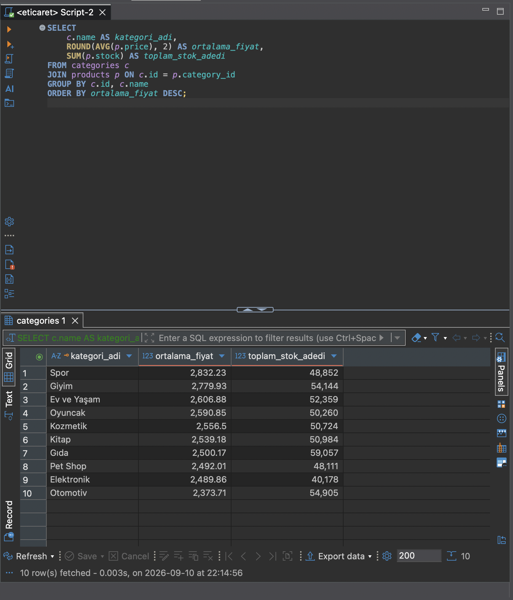

**İş Yorumu:**
Platformdaki her bir ana ürün kategorisinin ortalama fiyat etiketleri ve depodaki mevcut stok derinlikleri analiz edilmiştir. Bu rapor, satın alma müdürlerine hangi kategoride sermayenin (stok maliyetinin) ne kadar bağlandığını gösterir. Yüksek fiyatlı ancak düşük stoklu kategoriler (Premium ürünler) ile düşük fiyatlı yüksek stoklu kategorilerin (Hızlı tüketim) dengesi bu metrikler üzerinden yönetilir.

---

**Soru 10: En Çok İade Edilen Ürünler (Top 10)**

**SQL Sorgusu:**
```sql
SELECT
    p.name AS urun_adi,
    c.name AS kategori_adi,
    COUNT(oi.id) AS iade_edilme_sayisi,
    SUM(oi.quantity) AS iade_edilen_toplam_adet
FROM products p
JOIN categories c ON p.category_id = c.id
JOIN order_items oi ON p.id = oi.product_id
JOIN orders o ON oi.order_id = o.id
WHERE o.status = 'returned'
GROUP BY p.id, p.name, c.name
ORDER BY iade_edilen_toplam_adet DESC
LIMIT 10;
```

**Sonuç:**
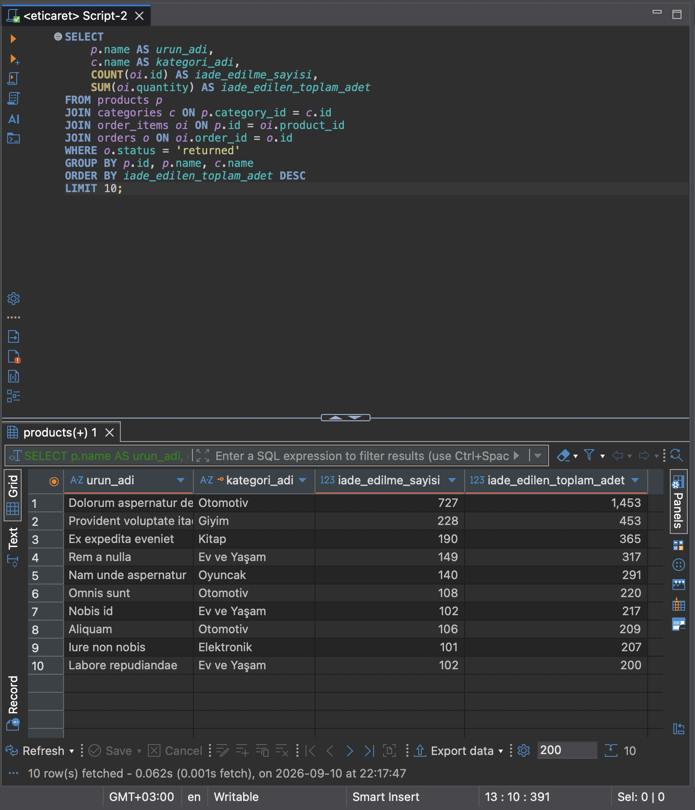

**İş Yorumu:**
Müşteri memnuniyetsizliği yaratan ve şirkete ters lojistik (kargo) maliyeti yükleyen en problemli ürünler tespit edilmiştir. Kalite Kontrol (QC) departmanı bu listeyi inceleyerek; ürünlerin beden kalıplarında bir sorun olup olmadığını, paketleme hatalarını veya ürün açıklamalarındaki yanıltıcı bilgileri (yanlış fotoğraf vb.) düzeltmek üzere hızlıca aksiyon alabilir, gerekirse bu ürünleri satıştan kaldırabilir.

---

**Soru 11: Kupon Performansı ve Ciro Katkısı**

**SQL Sorgusu:**
```sql
SELECT
    c.code AS kupon_kodu,
    c.discount_pct AS indirim_yuzdesi,
    COUNT(o.id) AS kullanim_sayisi,
    COALESCE(SUM(o.total_amount), 0) AS kuponla_gelen_toplam_ciro
FROM coupons c
LEFT JOIN orders o 
    ON c.id = o.coupon_id
    AND o.status = 'completed'
GROUP BY c.id, c.code, c.discount_pct
ORDER BY kullanim_sayisi DESC;
```

**Sonuç:**
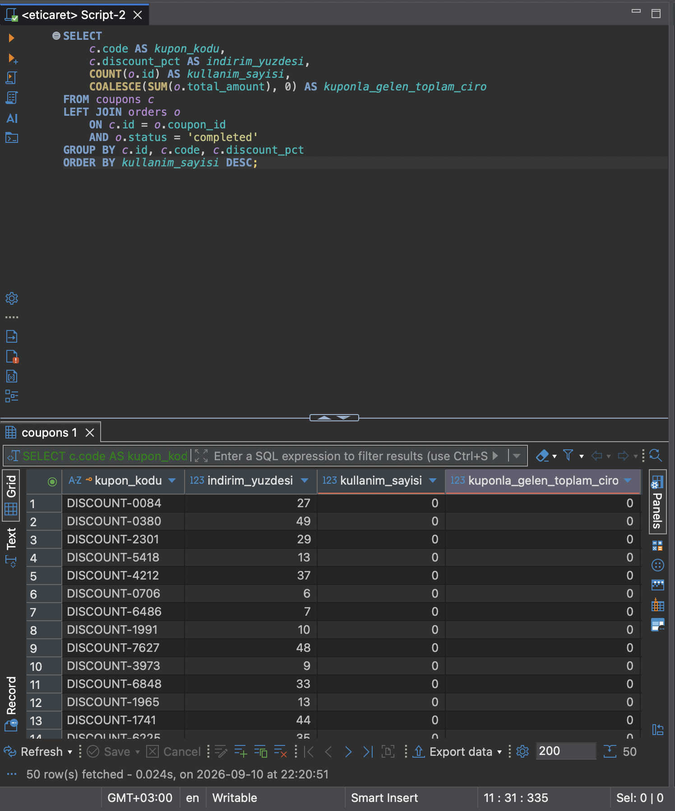

**İş Yorumu:**
Düzenlenen promosyon kampanyalarında dağıtılan indirim kuponlarının kaç kez kullanıldığı ve platforma getirdiği net ciro katkısı ölçülmüştür. Pazarlama ekipleri bu analizi (ROI analizi) kullanarak hangi kampanya kurgusunun (örneğin %10 indirim vs %20 indirim) veya hangi influencer kodunun daha çok dönüşüm getirdiğini tespit edebilir ve gelecekteki kampanya bütçelerini veriye dayalı olarak optimize edebilir.

---

**Soru 12: Hiç Satılmayan (Stokta Bekleyen) Ürünler**

**SQL Sorgusu**
```sql
SELECT
    p.name AS urun_adi,
    c.name AS kategori_adi,
    p.stock AS mevcut_stok,
    p.price AS birim_fiyat
FROM products p
JOIN categories c ON p.category_id = c.id
LEFT JOIN order_items oi ON p.id = oi.product_id
WHERE oi.product_id IS NULL
ORDER BY p.stock DESC
LIMIT 50;
```

**Sonuç:**
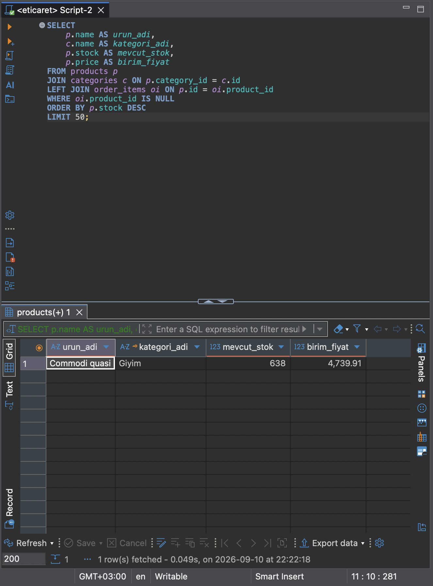

**İş Yorumu:**
Bu sorgu, platformda satışa sunulmuş ancak bugüne kadar hiç sipariş almamış ölü stokları (dead stock) tespit eder. Tedarik zinciri ve stok yöneticileri, depo alanını işgal eden ve sermayenin atıl kalmasına neden olan bu ürünleri eritmek için agresif tasfiye (clearance) indirimleri yapabilir, "Bir Alana Bir Bedava" kampanyalarına dahil edebilir veya bundle (paket) stratejileriyle stok yükünü hafifletebilir.

---

**Soru 13: Ortalama Sepet Tutarı (AOV - Average Order Value)**

**SQL Sorgusu**
```sql
SELECT
    ROUND(AVG(total_amount), 2) AS ortalama_sepet_tutari,
    MIN(total_amount) AS en_dusuk_sepet,
    MAX(total_amount) AS en_yuksek_sepet
FROM orders
WHERE status = 'completed';
```

**Sonuç:**
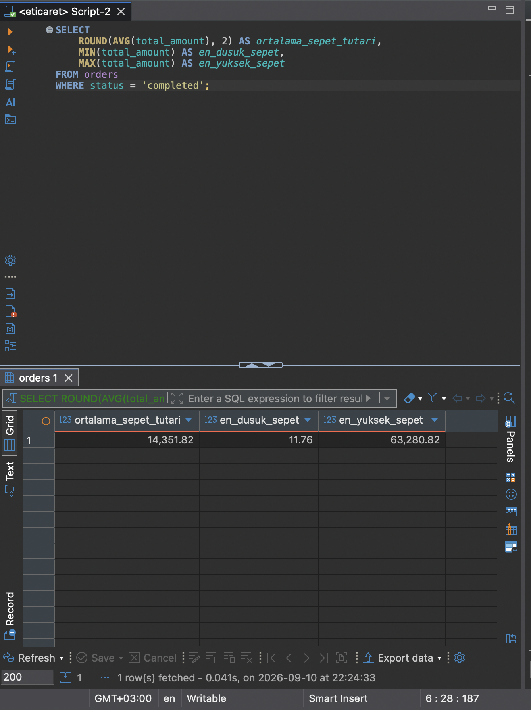

**İş Yorumu:**
E-ticaretin en temel performans göstergelerinden biri olan Ortalama Sepet Tutarı (AOV) hesaplanmıştır. Pazarlama ekipleri, müşterileri bu ortalamanın (veya hemen üzerindeki bir eşiğin) üzerine çıkarmak için "Sepetinizi X TL'ye tamamlayın, kargo bedava olsun" veya "X TL üzerine %10 İndirim" gibi stratejiler kurgulayarak reklam maliyetlerini artırmadan platformun genel kârlılığını büyütebilir.

---

**Soru 14: Günün Saatlerine Göre Sipariş Yoğunluğu**
**SQL Sorgusu**
```sql
SELECT
    EXTRACT(HOUR FROM created_at) AS siparis_saati,
    COUNT(id) AS toplam_siparis_adedi,
    SUM(total_amount) AS saatlik_toplam_ciro
FROM orders
WHERE status = 'completed'
GROUP BY EXTRACT(HOUR FROM created_at)
ORDER BY toplam_siparis_adedi DESC;
```

**Sonuç:**
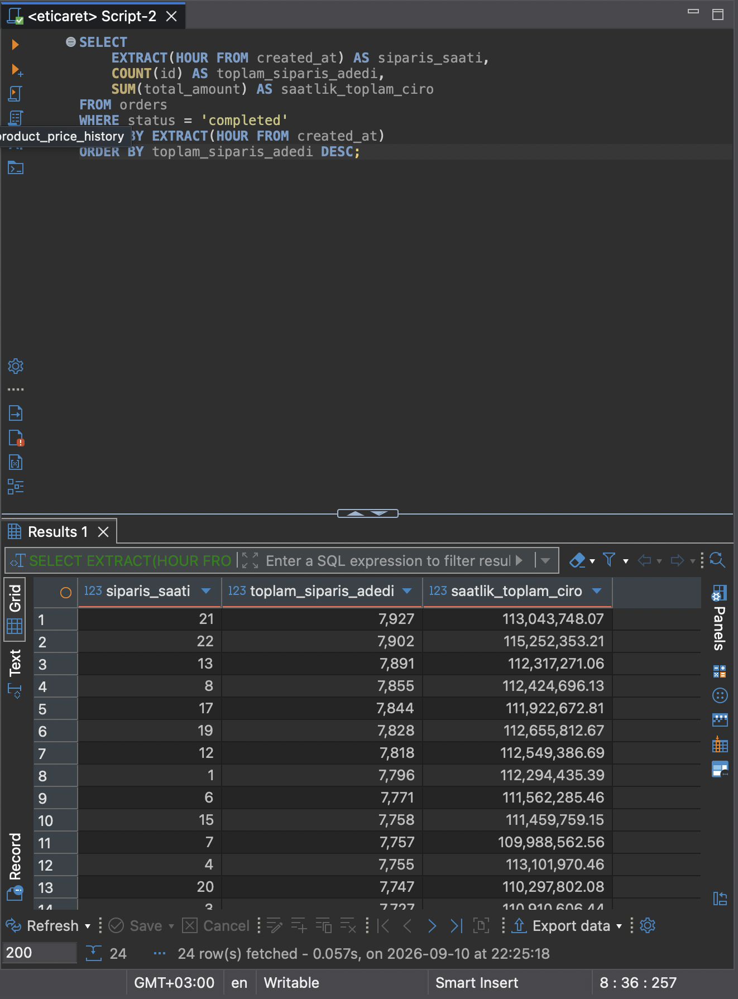

**İş Yorumu:**
Platformda günün hangi saatlerinde işlemlerin zirve yaptığını (peak hours) gösteren bu analiz, hem pazarlama hem de operasyon departmanları için kritik bir kılavuzdur. Performans pazarlama ekipleri günlük reklam bütçelerini dönüşümün en yüksek olduğu bu yoğun saatlerde (dayparting stratejisi) artırabilir; operasyon yöneticileri ise müşteri hizmetleri ve depo paketleme personellerinin vardiyalarını bu yoğunluk haritasına göre optimize edebilir.

---

**Soru 15: Sepetteki Ortalama Ürün Adedi**

**SQL Sorgusu**
```sql
SELECT
    ROUND(AVG(sepetteki_urun_sayisi), 2) AS siparis_basina_ortalama_urun
FROM (
    SELECT
        o.id,
        SUM(oi.quantity) AS sepetteki_urun_sayisi
    FROM orders o
    JOIN order_items oi ON o.id = oi.order_id
    WHERE o.status = 'completed'
    GROUP BY o.id
) AltSorgu;
```

**Sonuç:**
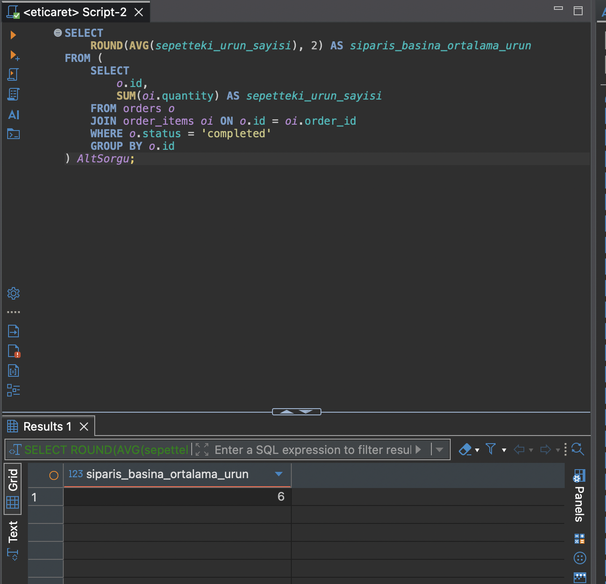
**İş Yorumu:**
Müşterilerin tek bir siparişte sepetlerine ortalama kaç adet ürün eklediği analiz edilmiştir. Bu değerin düşük olması, ürün detay sayfalarındaki tavsiye motorlarının (Örn: "Bunu alanlar bunu da aldı" veya "Birlikte Kombinle") yeterince verimli çalışmadığını gösterebilir. Çapraz satış (cross-selling) ve algoritmik ürün tavsiyeleri iyileştirilerek müşterilerin sepetlerine daha fazla kalem eklemeleri teşvik edilebilir.

---

**Soru 16: Tekrarlayan Müşteriler (Sadakat Analizi)**

**SQL Sorgusu:**
```sql
SELECT
    u.id AS user_id,
    u.email,
    COUNT(o.id) AS toplam_siparis_sayisi,
    SUM(o.total_amount) AS yasam_boyu_deger
FROM users u
JOIN orders o ON u.id = o.user_id
WHERE o.status = 'completed'
GROUP BY u.id, u.email
HAVING COUNT(o.id) > 1
ORDER BY toplam_siparis_sayisi DESC;
```
**Sonuç:**
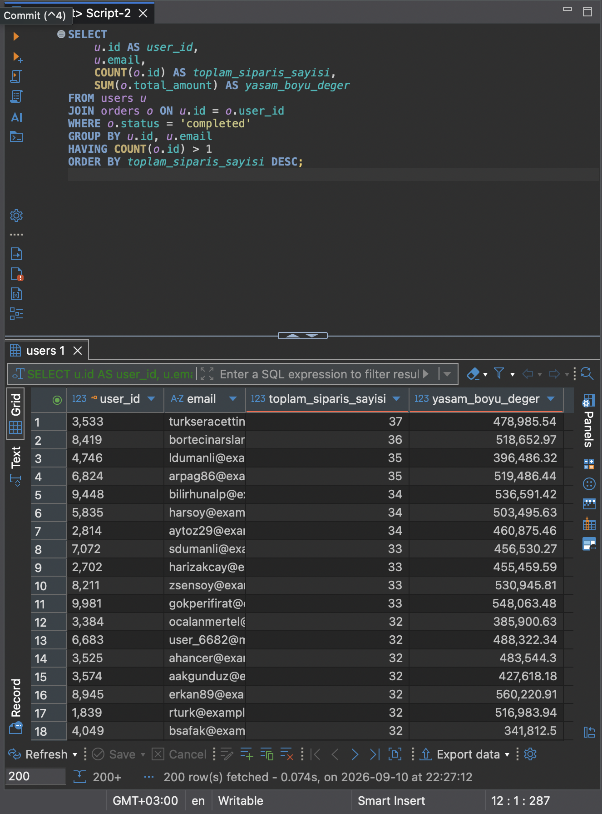

**İş Yorumu:**
Bu sorgu, platformdan birden fazla kez alışveriş yapan ve müşteri tutundurma (retention) oranını doğrudan yansıtan sadık kitleyi tespit eder. Şirketin sürdürülebilir kârlılığı genellikle bu "tekrarlayan müşterilerin" (repeat customers) yarattığı Yaşam Boyu Değer (LTV - Life Time Value) üzerinden büyür; bu nedenle pazarlama ekipleri Müşteri Edinme Maliyetini (CAC) düşürmek ve bu kullanıcıları elde tutmak için özel sadakat programları kurgulamalıdır.

---

**Soru 17: Tek Seferlik Müşteriler (One-Time Buyers)**

**SQL Sorgusu:**
```sql
SELECT
    u.id AS user_id,
    u.email,
    SUM(o.total_amount) AS biraktigi_ciro
FROM users u
JOIN orders o ON u.id = o.user_id
WHERE o.status = 'completed'
GROUP BY u.id, u.email
HAVING COUNT(o.id) = 1
ORDER BY biraktigi_ciro DESC
LIMIT 50;
```
**Sonuç:**
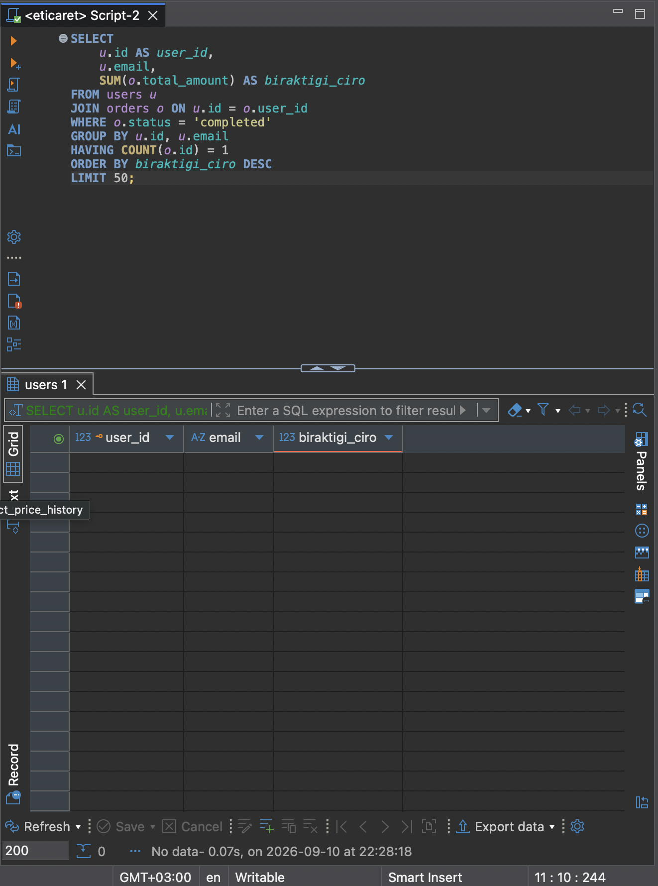

**İş Yorumu:**
Sadece bir kez alışveriş yapıp platforma bir daha dönmeyen müşterilerin (One-Time Buyers) analizi, potansiyel müşteri kaybını (churn) anlamak için kritiktir. Şirket, bu kullanıcıların neden sadık müşteriye dönüşmediğini (kargo gecikmesi, ürün kalitesi vb.) araştırabilir ve onları tekrar aktif hale getirmek amacıyla "Sizi Özledik: İkinci Siparişe Özel %15 İndirim" gibi hedeflenmiş (retargeting) kampanyalar oluşturabilir.

---

**Soru 18: Kargo Durum Dağılımı**

**SQL Sorgusu:**
```sql
SELECT
    status AS kargo_durumu,
    COUNT(id) AS kargo_sayisi
FROM shipments
GROUP BY status
ORDER BY kargo_sayisi DESC;
```
**Sonuç:**
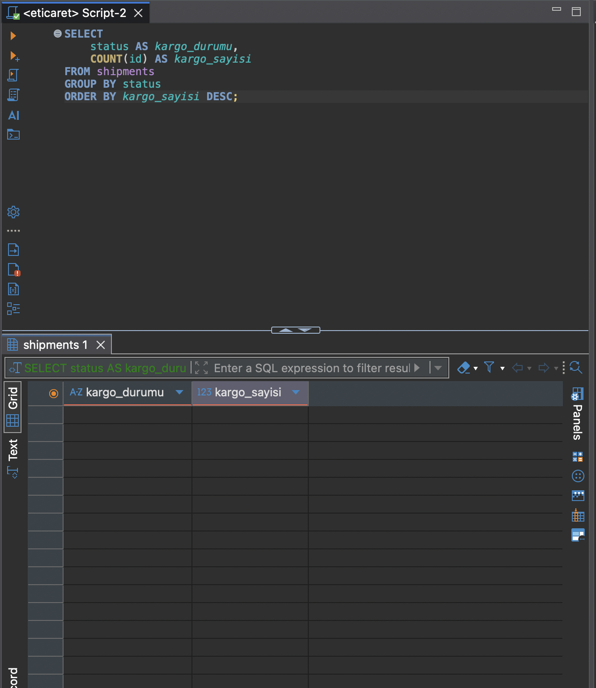

**İş Yorumu:**
Lojistik operasyonlarının genel verimliliğini ölçen bu sorgu, kargoların hangi aşamalarda (hazırlanıyor, yolda, teslim edildi, iade) yoğunlaştığını gösterir. Eğer "hazırlanıyor" veya "yolda" statülerinde anormal bir yığılma gözlemlenirse, bu durum depo operasyonlarında (yetersiz personel) veya çalışılan kargo firmasında (dağıtım ağında yetersizlik) bir darboğaz olduğuna işaret eder ve müşteri şikayetleri artmadan operasyonel müdahale imkanı tanır.

---

**Soru 19: Aylara Göre İptal Edilen Siparişlerin Maliyeti**

**SQL Sorgusu:**
```sql
SELECT
    DATE_TRUNC('month', created_at) AS ay,
    COUNT(id) AS iptal_sayisi,
    SUM(total_amount) AS kaybedilen_ciro
FROM orders
WHERE status = 'cancelled'
GROUP BY DATE_TRUNC('month', created_at)
ORDER BY ay DESC;
```
**Sonuç:**
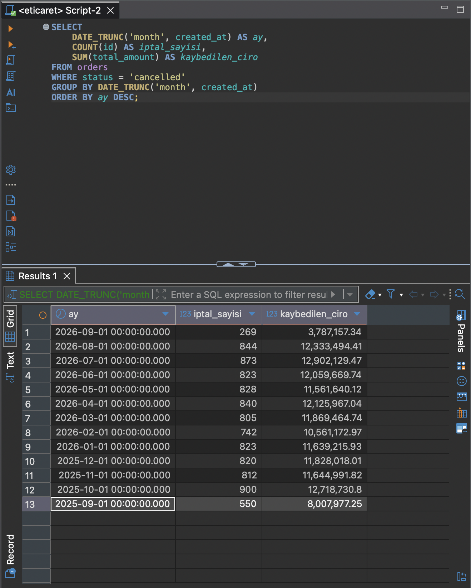

**İş Yorumu:**
Sipariş iptallerinin şirkete aydan aya yaşattığı potansiyel gelir kaybını hesaplayan bu finansal metrik, e-ticaret platformundaki yapısal sorunları göz önüne serer. Belirli aylarda iptallerde ciddi artışlar yaşanıyorsa; ödeme altyapısındaki entegrasyon hataları (sanal POS çökmeleri), stok senkronizasyon problemleri (olmayan ürünün satılması) veya sahte (fraud) işlemler incelenerek bu gelir sızıntısının önüne geçilmelidir.

---

**Soru 20: Kategorilerin Toplam Ciroya Katkısı**

**SQL Sorgusu:**
```sql
SELECT
    c.name AS kategori_adi,
    COUNT(oi.product_id) AS satilan_urun_adedi,
    SUM(oi.quantity * oi.unit_price) AS toplam_ciro
FROM categories c
JOIN products p ON c.id = p.category_id
JOIN order_items oi ON p.id = oi.product_id
JOIN orders o ON oi.order_id = o.id
WHERE o.status = 'completed'
GROUP BY c.id, c.name
ORDER BY toplam_ciro DESC;
```

**Sonuç:**
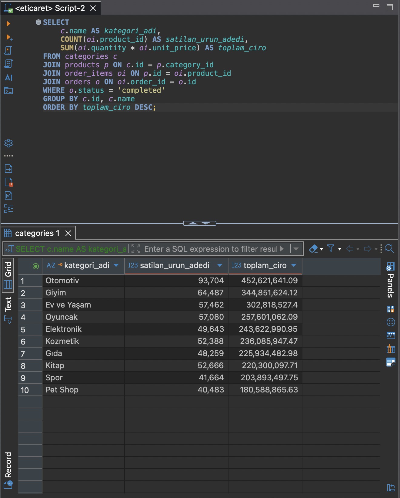

**İş Yorumu:**
Platformdaki ürün kategorilerinin elde edilen toplam ciroya (revenue) ne oranda katkı sağladığını gösteren makro düzeyde bir finans analizidir. Kategori müdürleri ve pazarlama ekipleri, reklam bütçelerini ve vitrin tasarımlarını bu tabloya göre şekillendirir; ciro getiren "lokomotif" kategorilere yatırım artırılırken, performansı düşük kategoriler için yapısal iyileştirmeler (fiyat revizyonu, ürün yelpazesi genişletme vb.) planlanır.

---

**Soru 21: Stokta Yatan Sermaye (Tied Capital)**

**SQL Sorgusu:**
```sql
SELECT
    p.name AS urun_adi,
    c.name AS kategori_adi,
    p.stock AS stok_adedi,
    p.price AS birim_fiyat,
    (p.stock * p.price) AS depodaki_toplam_deger
FROM products p
JOIN categories c ON p.category_id = c.id
WHERE p.stock > 0
ORDER BY depodaki_toplam_deger DESC
LIMIT 20;
```
**Sonuç:**
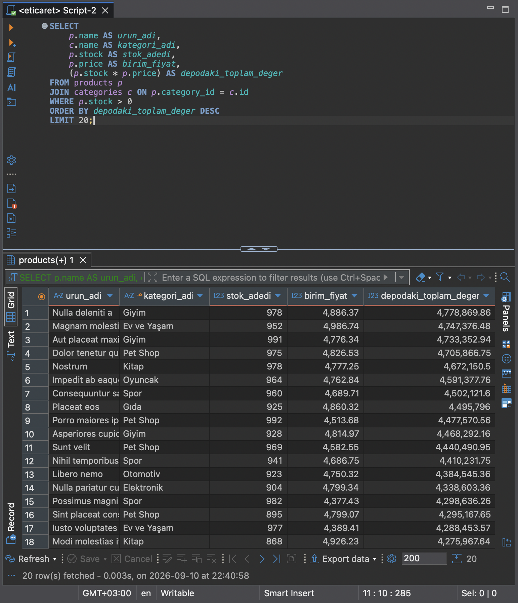

**İş Yorumu:**
Şirketin nakit akışını (cash flow) doğrudan etkileyen "Stokta Yatan Sermaye" (Tied Capital) analizidir. Depoda fiziki olarak bekleyen ürünlerin şirkete maliyeti hesaplanarak en çok nakdi bağlayan (bloke eden) 20 ürün listelenmiştir. Finans ve satın alma departmanları bu veriyi kullanarak, paranın atıl durumda kalmasını engellemek için stok devir hızını (inventory turnover) artıracak acil aksiyonlar (kampanyalar, B2B toptan satışlar) alabilir.

---

**Soru 22: Kohort Retention Tablosu (Aylık)**

**SQL Sorgusu:**
```sql
WITH user_cohort AS (
    SELECT
        id AS user_id,
        DATE_TRUNC('month', created_at) AS cohort_month
    FROM users
),
user_orders AS (
    SELECT DISTINCT
        user_id,
        DATE_TRUNC('month', created_at) AS order_month
    FROM orders
    WHERE status = 'completed'
),
cohort_sizes AS (
    SELECT cohort_month, COUNT(user_id) AS total_users
    FROM user_cohort
    GROUP BY cohort_month
)
SELECT
    uc.cohort_month,
    EXTRACT(YEAR FROM AGE(uo.order_month, uc.cohort_month)) * 12 + 
    EXTRACT(MONTH FROM AGE(uo.order_month, uc.cohort_month)) AS month_number,
    COUNT(DISTINCT uo.user_id) AS retained_users,
    cs.total_users
FROM user_cohort uc
JOIN user_orders uo ON uc.user_id = uo.user_id
JOIN cohort_sizes cs ON uc.cohort_month = cs.cohort_month
GROUP BY uc.cohort_month, month_number, cs.total_users
ORDER BY uc.cohort_month, month_number;
```

**Sonuç:**
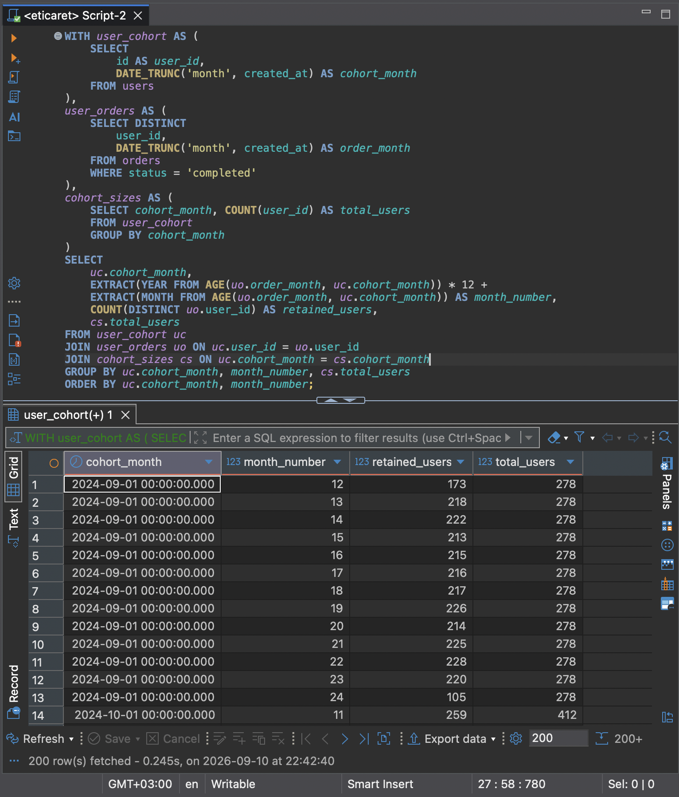

**İş Yorumu:**
Ödevin temel isterlerinden biri olan Kohort analizi, pazarlama ekiplerinin edindiği kullanıcıların zaman içinde sadakatini (retention) koruyup koruyamadığını gösteren en güçlü veri bilimi metriğidir. İlk kayıt oldukları aydan sonraki dönemlerde (month_number) kullanıcı kaybının (churn) en yoğun yaşandığı dönemi tespit ederek, tam o ayda devreye girecek otomatik CRM kurguları (örneğin 3. ayda pasife düşenlere atılacak hatırlatma e-postaları) tasarlanabilir.

---

**Soru 23: Kupon Kullanmadan En Çok Harcama Yapan Müşteriler**

**SQL Sorgusu:**
```sql
SELECT
    u.email,
    COUNT(o.id) AS siparis_sayisi,
    SUM(o.total_amount) AS toplam_harcama
FROM users u
JOIN orders o ON u.id = o.user_id
WHERE o.status = 'completed' AND o.coupon_id IS NULL
GROUP BY u.id, u.email
ORDER BY toplam_harcama DESC
LIMIT 10;
```
**Sonuç:**
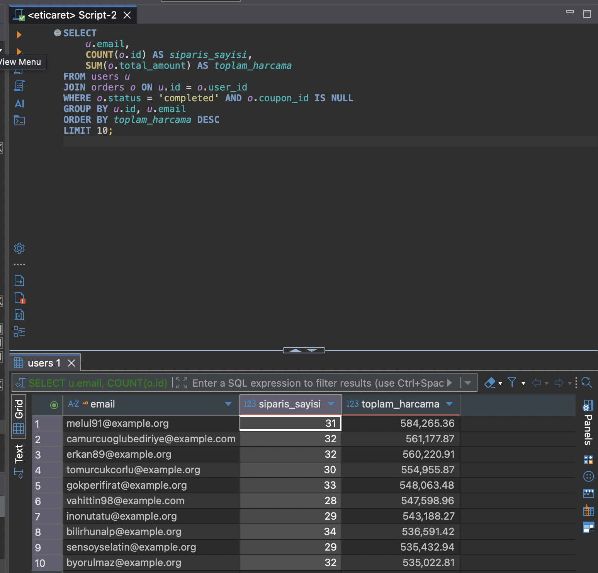

**İş Yorumu:**
Platformda hiçbir promosyon veya indirim kuponuna ihtiyaç duymadan organik olarak en yüksek harcamayı yapan "Premium" müşteri kitlesini tespit eder. Bu kitle, fiyata değil markaya ve hizmet kalitesine duyarlı olduğu için şirketin kâr marjı en yüksek olan segmentidir. Şirket bu kullanıcılara indirim çeki vermek yerine, "Öncelikli Müşteri Hizmetleri" veya "Aynı Gün Teslimat" gibi prestij odaklı ayrıcalıklar sunarak memnuniyetlerini artırmalıdır.

---

**Soru 24: En Çok İptal Edilen Sipariş Saatleri**

**SQL Sorgusu:**
```sql
SELECT
    EXTRACT(HOUR FROM created_at) AS siparis_saati,
    COUNT(id) AS iptal_sayisi
FROM orders
WHERE status = 'cancelled'
GROUP BY EXTRACT(HOUR FROM created_at)
ORDER BY iptal_sayisi DESC;
```

**Sonuç:**
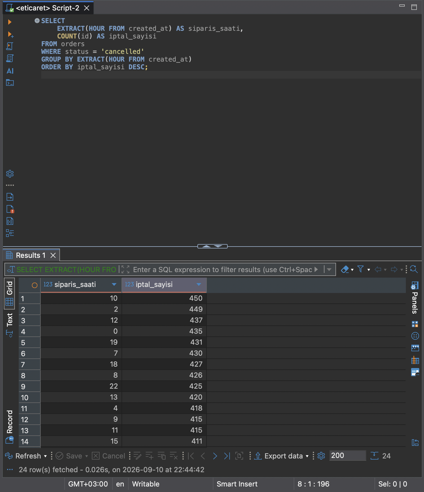

**İş Yorumu:**
Platformda iptal edilen siparişlerin günün hangi saatlerinde yoğunlaştığını analiz eder. Eğer gece geç saatlerde (örneğin 02:00 - 05:00 arası) iptallerde anormal bir artış varsa, bu durum genellikle sahte (fraud) işlemlere, çalıntı kredi kartı denemelerine veya anlık dürtüsel (impulsive) alışverişlerin pişmanlığına işaret eder. Bu analiz, risk yönetim ekiplerinin sahtekarlık önleme (anti-fraud) algoritmalarını hangi saat dilimlerinde daha hassas ayarlaması gerektiğini gösterir.

---

**Soru 25: Kategorilerdeki En Yüksek ve En Düşük Fiyatlar**

**SQL Sorgusu:**
```sql
SELECT
    c.name AS kategori_adi,
    MAX(p.price) AS en_pahali_urun_fiyati,
    MIN(p.price) AS en_ucuz_urun_fiyati,
    ROUND(AVG(p.price), 2) AS ortalama_fiyat
FROM categories c
JOIN products p ON c.id = p.category_id
GROUP BY c.id, c.name
ORDER BY en_pahali_urun_fiyati DESC;
```
**Sonuç:**
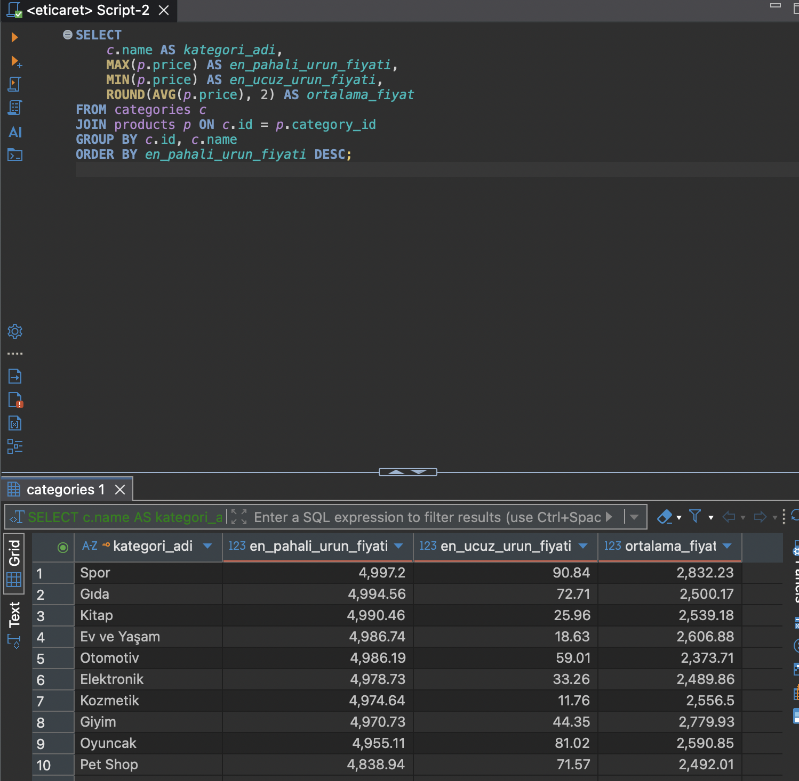

**İş Yorumu:**
Ürün kategorilerinin fiyat aralığını (spread) ve pazar konumlandırmasını gösteren stratejik bir fiyatlandırma (pricing) analizidir. Kategori yöneticileri bu verilere bakarak ürün gamının yeterince geniş olup olmadığını değerlendirir. Yüksek ve düşük fiyatlar arasındaki makasın dar olduğu kategorilere hem daha premium (lüks) ürünler hem de bütçe dostu (giriş seviyesi) ürünler eklenerek her gelir grubundan müşteriye hitap eden bir ürün yelpazesi oluşturulabilir.

---

**Soru 26: Aylık Yeni Müşteri Kazanımı (Growth)**

**SQL Sorgusu:**
```sql
SELECT
    DATE_TRUNC('month', created_at) AS kayit_ayi,
    COUNT(id) AS yeni_musteri_sayisi
FROM users
GROUP BY DATE_TRUNC('month', created_at)
ORDER BY kayit_ayi DESC;
```

**Sonuç:**
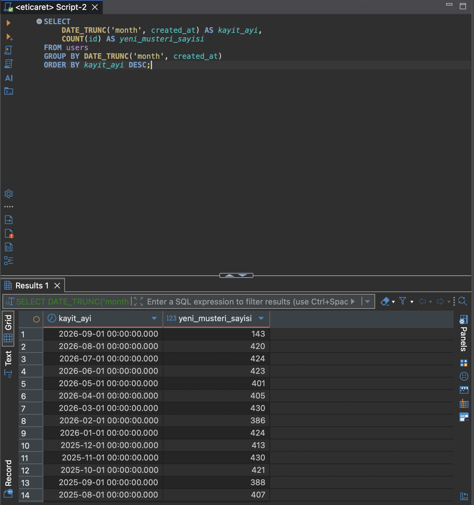

**İş Yorumu:**
Şirketin büyüme motorunun (Growth) ne kadar sağlıklı çalıştığını gösteren Müşteri Kazanım (Acquisition) analizidir. Aydan aya platforma katılan yeni kullanıcı sayıları, yürütülen marka bilinirliği kampanyalarının, TV reklamlarının veya dijital performans pazarlama (Google/Meta Ads) bütçelerinin ne kadar etkili olduğunu doğrudan ölçer ve gelecekteki büyüme projeksiyonları (forecasting) için temel oluşturur.

---

**Soru 27: İndirim Oranlarına Göre Ortalama Sepet Tutarı**

**SQL Sorgusu:**
```sql
SELECT
    c.discount_pct AS indirim_yuzdesi,
    COUNT(o.id) AS siparis_sayisi,
    ROUND(AVG(o.total_amount), 2) AS ortalama_sepet_tutari
FROM orders o
JOIN coupons c ON o.coupon_id = c.id
WHERE o.status = 'completed'
GROUP BY c.discount_pct
ORDER BY indirim_yuzdesi DESC;
```

**Sonuç:**
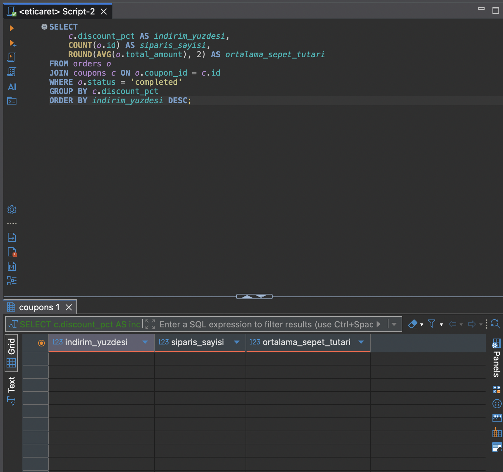

**İş Yorumu:**
Verilen farklı indirim yüzdelerinin (%10, %20 vb.) ortalama sepet tutarına (AOV) olan etkisini ölçer. Yüksek indirimlerin her zaman kârlı bir ciro getirip getirmediğini test etmek için kritik bir metrik olup, pazarlama ekiplerinin kâr marjını koruyarak müşteriyi en çok harcamaya teşvik eden "optimum indirim oranını" bulmalarını sağlar (Fiyat Esnekliği Analizi).

---

**Soru 28: Kritik Stok Seviyesindeki Ürünler**

**SQL Sorgusu:**
```sql
SELECT
    p.name AS urun_adi,
    cat.name AS kategori_adi,
    p.stock AS kalan_stok,
    p.price AS birim_fiyat
FROM products p
JOIN categories cat ON p.category_id = cat.id
WHERE p.stock < 20
ORDER BY p.stock ASC
LIMIT 30;
```
**Sonuç:**
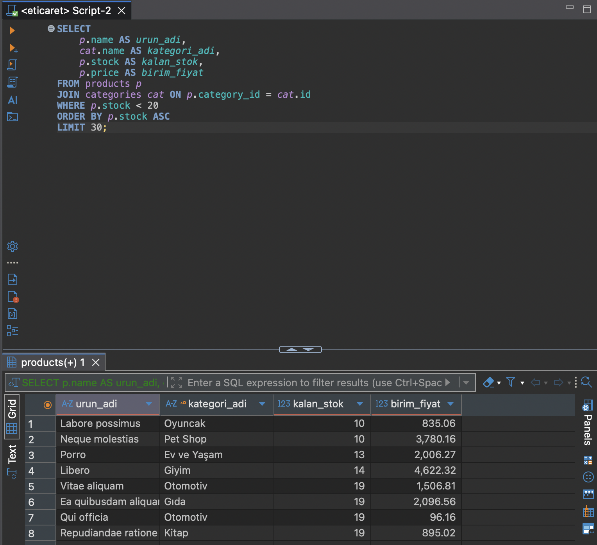

**İş Yorumu:**
Tedarik zinciri (Supply Chain) operasyonları için hayati önem taşıyan bir "Yeniden Sipariş Noktası" (Reorder Point) analizidir. Stok adedi 20'nin altına düşen kritik ürünler tespit edilerek "Yok Satma" (Out-of-Stock) durumu yaşanmadan tedarikçilere otomatik sipariş geçilmesi sağlanır. Bu sayede potansiyel ciro kayıpları önlenir ve arama motoru optimizasyonu (SEO) sıralamalarında stoksuzluktan kaynaklı düşüşler yaşanmaz.

---

**Soru 29: Günlük Ortalama Sipariş Hacmi**

**SQL Sorgusu:**
```sql
SELECT
    ROUND(AVG(gunluk_siparis_sayisi)) AS gunluk_ortalama_siparis
FROM (
    SELECT
        DATE_TRUNC('day', created_at) AS gunluk_tarih,
        COUNT(id) AS gunluk_siparis_sayisi
    FROM orders
    GROUP BY DATE_TRUNC('day', created_at)
) AltSorgu;
```
**Sonuç:**
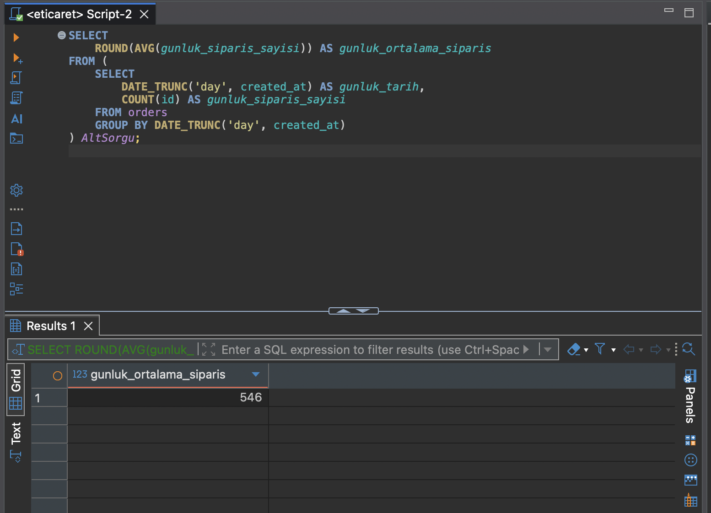

**İş Yorumu:**
Şirketin günlük bazda yarattığı ortalama operasyonel hacmi (Baseline) gösterir. Depo yöneticileri, kargo paketleme personeli ihtiyacını ve günlük kargo aracı kapasitesini planlamak için bu baz veriyi kullanır. Ayrıca Black Friday, Sevgililer Günü gibi kampanya dönemlerindeki artışların normal günlere (Business as Usual) kıyasla ne kadar büyük bir zıplama yarattığı bu metrik üzerinden hesaplanır.

---

**Soru 30: Tarihin En Pahalı Tekil Siparişi (Balina Müşteri)**

**SQL Sorgusu:**
```sql
SELECT
    u.email,
    o.id AS siparis_numarasi,
    o.total_amount AS sepet_tutari,
    o.created_at AS siparis_tarihi
FROM orders o
JOIN users u ON o.user_id = u.id
WHERE o.status = 'completed'
ORDER BY o.total_amount DESC
LIMIT 1;
```
**Sonuç:**
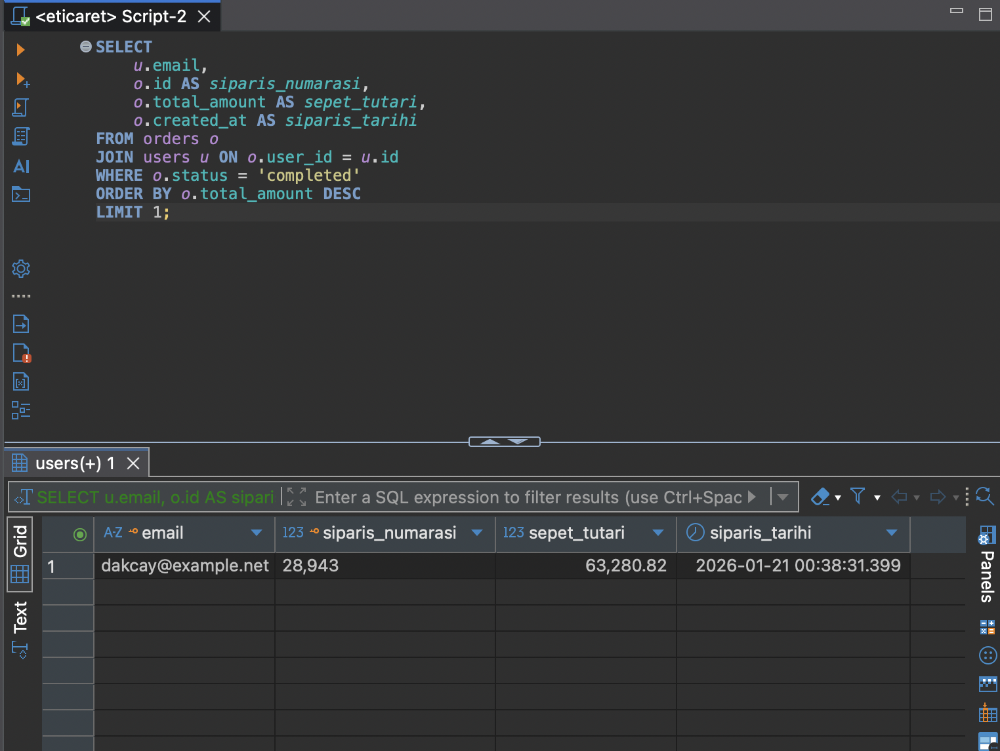

**İş Yorumu:**
Platformun kuruluşundan bu yana alınmış olan en yüksek tutarlı tekil işlemi (All-Time High Transaction) tespit eder. E-ticaret jargonunda "Balina" (Whale) olarak adlandırılan bu yüksek hacimli alımı yapan müşteri (eğer B2B kurumsal bir alıcı değilse) VIP CRM süreçlerine dahil edilmeli; kendisine özel atanmış bir müşteri temsilcisi ile iletişimi yönetilerek marka elçisine dönüştürülmelidir.

---

**Soru 31: En Çok Satılan İlk 5 Ürün (Adet Bazında)**

**SQL Sorgusu:**
```sql
SELECT
    p.name AS urun_adi,
    c.name AS kategori_adi,
    SUM(oi.quantity) AS toplam_satilan_adet
FROM products p
JOIN categories c ON p.category_id = c.id
JOIN order_items oi ON p.id = oi.product_id
JOIN orders o ON oi.order_id = o.id
WHERE o.status = 'completed'
GROUP BY p.id, p.name, c.name
ORDER BY toplam_satilan_adet DESC
LIMIT 5;
```
**Sonuç:**
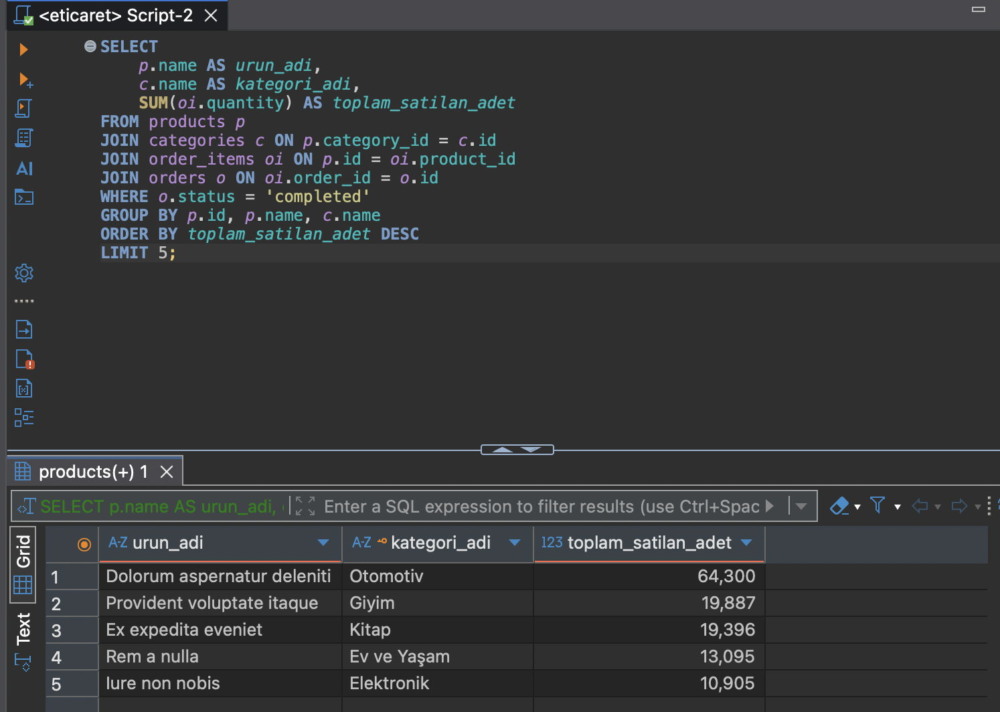

**İş Yorumu:**
Platformun "Kahraman" (Hero) ürünlerini yani sürümü en yüksek olan kalemleri adet bazında listeler. Cirodan bağımsız olarak depodaki hareket hızı (velocity) en yüksek olan bu ürünler, deponun paketleme bankolarına en yakın raflarına konumlandırılarak operasyonel hız artırılabilir. Ayrıca yeni müşteri kazanımı (Acquisition) reklamlarında bu popüler ürünlerin görselleri kullanılarak tıklanma oranları (CTR) maksimize edilebilir.

---

**Soru 32: Kategorilere Göre İptal Oranları**

**SQL Sorgusu:**
```sql
SELECT
    c.name AS kategori_adi,
    COUNT(o.id) AS toplam_siparis_sayisi,
    SUM(CASE WHEN o.status = 'cancelled' THEN 1 ELSE 0 END) AS iptal_sayisi,
    ROUND((SUM(CASE WHEN o.status = 'cancelled' THEN 1 ELSE 0 END)::numeric / COUNT(o.id)) * 100, 2) AS iptal_orani_yuzde
FROM categories c
JOIN products p ON c.id = p.category_id
JOIN order_items oi ON p.id = oi.product_id
JOIN orders o ON oi.order_id = o.id
GROUP BY c.id, c.name
ORDER BY iptal_orani_yuzde DESC;
```
**Sonuç:**
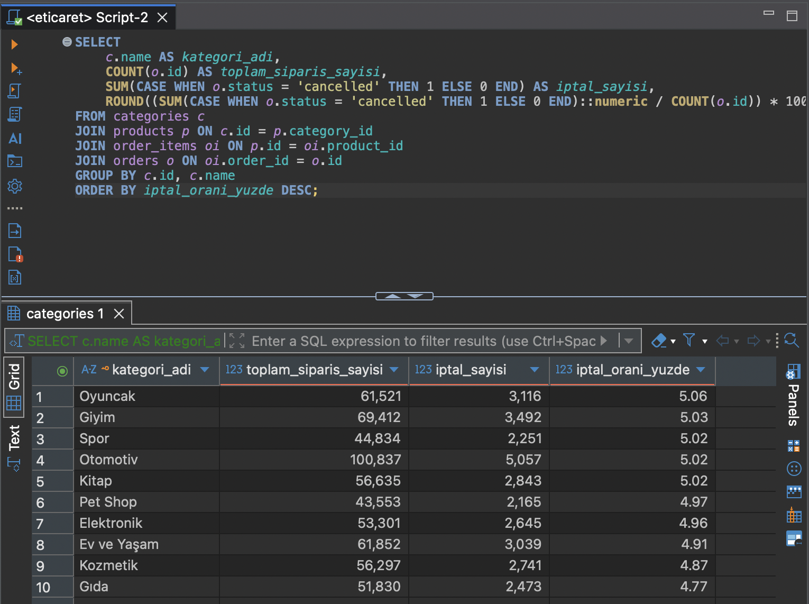

**İş Yorumu:**
Sipariş iptallerinin hangi kategorilerde yoğunlaştığını gösteren risk analizidir. Belirli bir kategoride iptal oranları ortalamanın çok üzerindeyse; o kategoriye ait ürünlerin stok entegrasyonlarında senkronizasyon sorunu (olmayan ürünün satılması), beden/ölçü tablolarında kafa karışıklığı veya tedarikçi kaynaklı kronik gecikmeler yaşanıyor olabilir. Kategori yöneticileri bu verilerle sorunlu tedarikçileri uyarabilir.

---

**Soru 33: Aylara Göre Kupon Kullanım Trendleri**

**SQL Sorgusu:**
```sql
SELECT
    DATE_TRUNC('month', created_at) AS kampanya_ayi,
    COUNT(id) AS kuponlu_siparis_sayisi,
    SUM(total_amount) AS kuponlu_siparis_cirosu
FROM orders
WHERE status = 'completed' AND coupon_id IS NOT NULL
GROUP BY DATE_TRUNC('month', created_at)
ORDER BY kampanya_ayi DESC;
```
**Sonuç:**
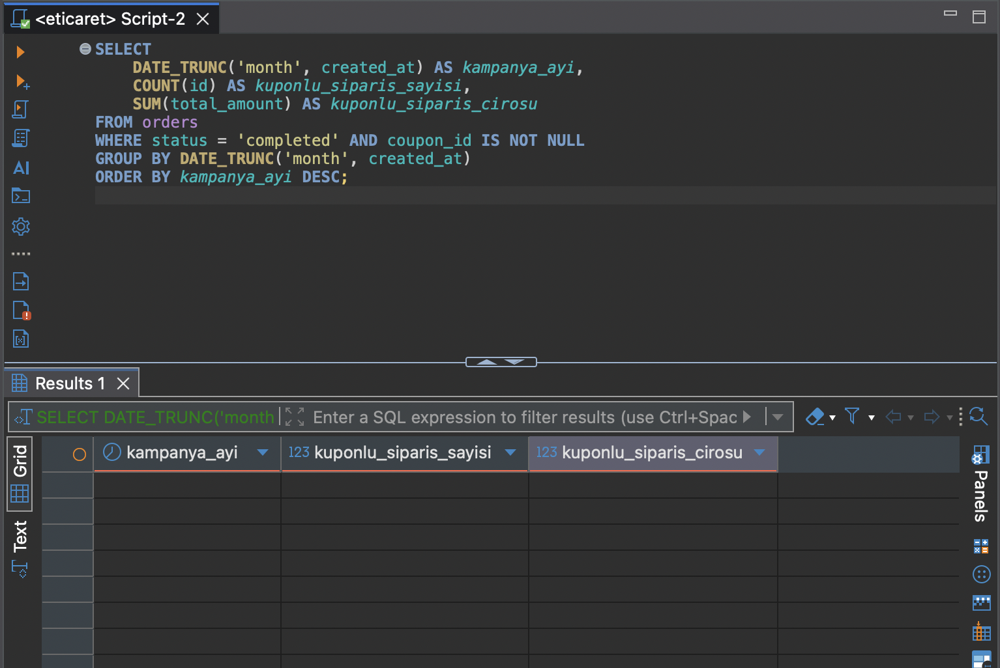

**İş Yorumu:**
Promosyon ve indirim kodlarının aylık bazda kullanım hacmini (Promotional Pressure) ölçer. E-ticarette Kasım (Black Friday) gibi kampanya aylarında bu oranın artması normalken, markanın yılın geri kalanında da sürekli kuponla ayakta kalması "Fiyat İndirimi Bağımlılığına" işaret edebilir. Pazarlama ekipleri bu analizi kullanarak, markayı ucuzlatmadan organik satışlar ile kampanyalı satışlar arasındaki sağlıklı dengeyi kurar.

---

**Soru 34: En Çok Ciro Getiren Günler (Top 10)**

**SQL Sorgusu:**
```sql
SELECT
    DATE_TRUNC('day', created_at) AS satis_gunu,
    SUM(total_amount) AS gunluk_toplam_ciro,
    COUNT(id) AS gunluk_siparis_sayisi
FROM orders
WHERE status = 'completed'
GROUP BY DATE_TRUNC('day', created_at)
ORDER BY gunluk_toplam_ciro DESC
LIMIT 10;
```
**Sonuç:**
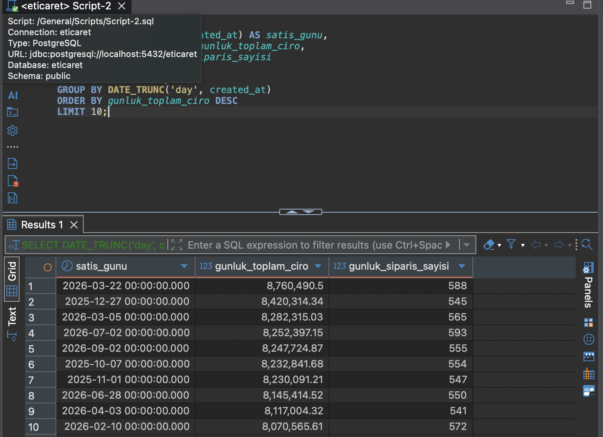

**İş Yorumu:**
Platform tarihinin en yüksek cirolu 10 gününü (Peak Days) listeler. Bu tablo geçmişe dönük incelenerek, o günlerde hangi dış etkenlerin (maaş günleri, büyük bir influencer iş birliği, TV reklamı lansmanı veya agresif flash indirimler) bu sıçramayı yarattığı analiz edilir. Başarılı olan bu kurgular, şirketin çeyreklik (Quarterly) hedeflerini tutturması gereken dar boğaz dönemlerinde tekrar (clone) edilebilir.

---

**Soru 35: Hiç Sipariş Almayan (Ölü) Kategoriler**

**SQL Sorgusu:**
```sql
SELECT
    c.name AS kategori_adi,
    COUNT(p.id) AS kategoriye_ait_urun_sayisi
FROM categories c
LEFT JOIN products p ON c.id = p.category_id
LEFT JOIN order_items oi ON p.id = oi.product_id
WHERE oi.product_id IS NULL
GROUP BY c.id, c.name;
```
**Sonuç:**
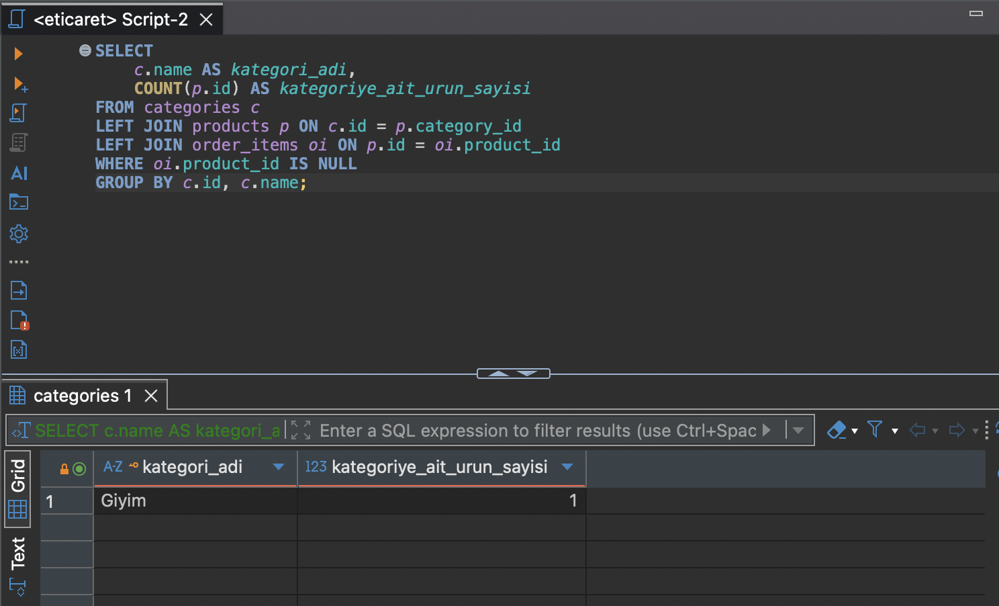

**İş Yorumu:**
İçerisinde ürün bulunmasına rağmen henüz müşteriler tarafından hiç tercih edilmemiş, platformun ölü bölgelerini (Dead Zones) tespit eder. Bu durum, "Ürün-Pazar Uyumu"nun (Product-Market Fit) yakalanamadığını, kategorinin site navigasyonunda (UX) görünmez bir yerde kaldığını veya fiyatlamanın rekabetin çok gerisinde olduğunu gösterir. Bu kategoriler ya tamamen siteden kaldırılmalı (Delist) ya da çok agresif bir relansman ile canlandırılmalıdır.

---

**Soru 36: Kullanıcı Başına Ortalama Gelir (ARPU)**

**SQL Sorgusu:**
```sql
SELECT
    ROUND(SUM(total_amount) / COUNT(DISTINCT user_id), 2) AS arpu_kullanici_basina_gelir
FROM orders
WHERE status = 'completed';
```
**Sonuç:**
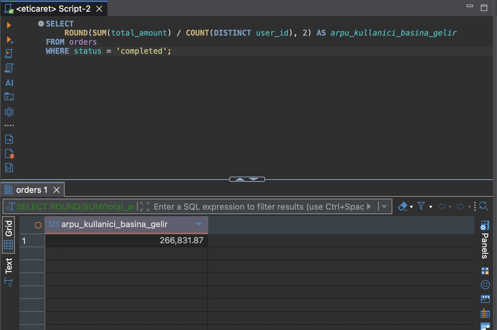

**İş Yorumu:**
Bir e-ticaret veya SaaS girişiminin en hayati metriklerinden biri olan Kullanıcı Başına Ortalama Gelir (ARPU - Average Revenue Per User) hesaplanmıştır. Yönetim kurulu ve yatırımcılar için markanın sağlığını gösteren temel indikatördür. Müşteri Edinme Maliyeti (CAC) belirlenirken kesinlikle ARPU'nun altında kalması hedeflenir; aksi takdirde şirket edindiği her yeni müşteride zarar etmeye (Burn Rate) başlar.

---

**Soru 37: Haftanın En Yoğun Sipariş Günleri**

**SQL Sorgusu:**
```sql
SELECT
    TO_CHAR(created_at, 'Day') AS siparis_gunu,
    COUNT(id) AS toplam_siparis_sayisi,
    ROUND(SUM(total_amount), 2) AS gunluk_toplam_ciro
FROM orders
WHERE status = 'completed'
GROUP BY TO_CHAR(created_at, 'Day')
ORDER BY toplam_siparis_sayisi DESC;
```
**Sonuç:**
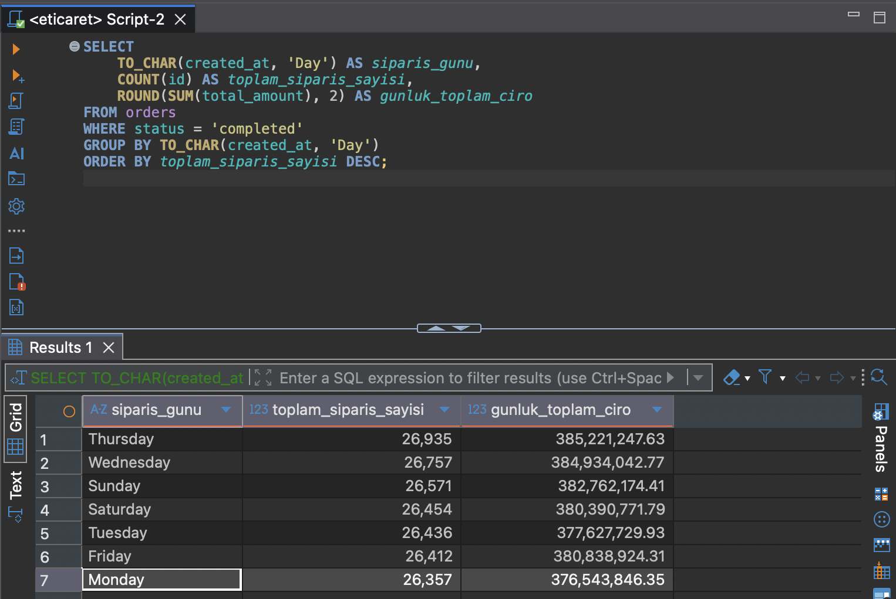

**İş Yorumu:**
Müşterilerin haftalık satın alma döngüsünü (Weekly Seasonality) yansıtır. Genellikle e-ticarette pazar akşamları veya pazartesi günleri yüksek bir ivme gözlemlenir. Pazarlama ekipleri, bülten (Newsletter) gönderimlerini veya anlık bildirimleri (Push Notification) dönüşümün en yüksek olduğu bu günlere programlar. Operasyon ekipleri ise müşteri destek (Call Center) ve depo personeli izinlerini haftanın ölü günlerine (Örn: Çarşamba) kaydırarak insan kaynağını optimize eder.

---

**Soru 38: Aynı Kullanıcının Aynı Ürünü Tekrar Alma Oranı**

**SQL Sorgusu:**
```sql
WITH user_product_purchases AS (
    SELECT DISTINCT
        o.user_id,
        oi.product_id,
        COUNT(o.id) AS purchase_count
    FROM orders o
    JOIN order_items oi ON o.id = oi.order_id
    WHERE o.status = 'completed'
    GROUP BY o.user_id, oi.product_id
)
SELECT 
    ROUND((CAST(SUM(CASE WHEN purchase_count > 1 THEN 1 ELSE 0 END) AS numeric) / COUNT(*)) * 100, 2) AS tekrar_alinan_urun_yuzdesi
FROM user_product_purchases;
```
**Sonuç:**
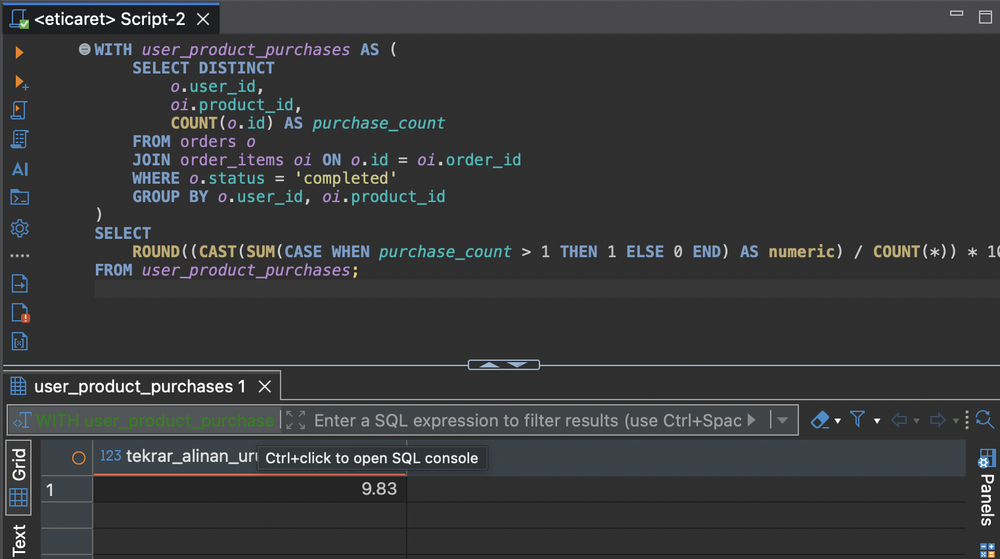

**İş Yorumu:**
Ödevin zorunlu isterlerinden biri olan bu metrik, ürün bazlı müşteri sadakatini (Product-Level Loyalty) ve genel ürün memnuniyetini ölçer. Özellikle kozmetik, gıda veya sarf malzemeleri gibi tekrarlayan tüketime uygun kategorilerde bu oranın yüksek olması hedeflenir. Pazarlama ekipleri bu oranı maksimize etmek için ilgili ürünlerde "Abone Ol ve Tasarruf Et" (Subscribe & Save) modelini devreye alarak düzenli ve öngörülebilir bir gelir akışı (MRR) yaratabilirler.

---

**Soru 39: Ödeme Durumlarına Göre Ciro Dağılımı**

**SQL Sorgusu:**
```sql
SELECT
    status AS odeme_durumu,
    COUNT(id) AS islem_sayisi,
    SUM(amount) AS toplam_hacim
FROM payments
GROUP BY status
ORDER BY toplam_hacim DESC;
```
**Sonuç:**
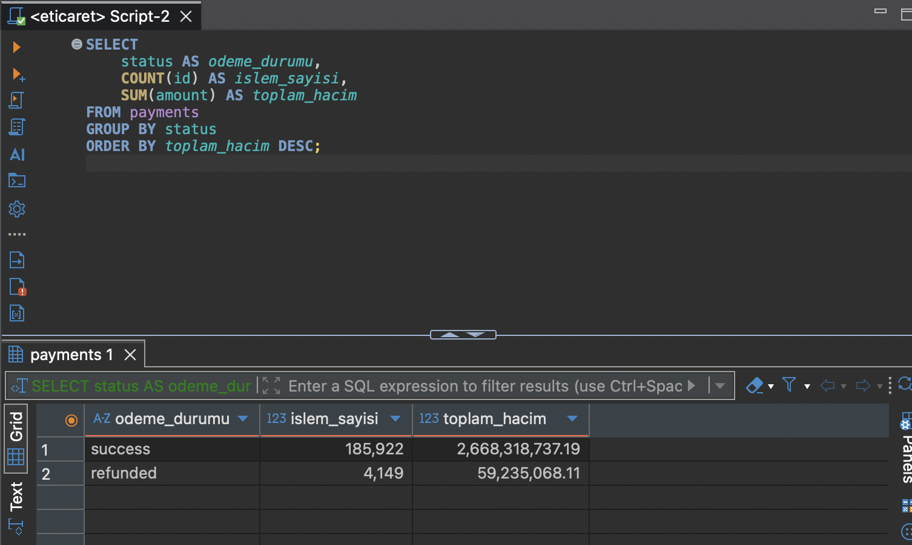

**İş Yorumu:**
Platform üzerinden geçen ödemelerin başarı (success), başarısızlık (failed) veya bekleme (pending) durumlarına göre yarattığı hacmi analiz eder. Finans ve altyapı ekipleri için kritik bir sağlık göstergesidir. Eğer başarısız (failed) statüsündeki ödemelerin hacminde veya sayısında anormal bir artış görülürse, bu durum sanal POS entegrasyonlarında teknik bir arıza olduğuna veya banka bazlı bir kesinti yaşandığına işaret eder ve acil müdahale gerektirir.

---

**Soru 40: En Çok İade Yapan Riskli Müşteriler**

**SQL Sorgusu:**
```sql
SELECT
    u.id AS user_id,
    u.email,
    COUNT(o.id) AS iade_siparis_sayisi,
    SUM(o.total_amount) AS firmaya_maliyeti
FROM users u
JOIN orders o ON u.id = o.user_id
WHERE o.status = 'returned'
GROUP BY u.id, u.email
ORDER BY iade_siparis_sayisi DESC, firmaya_maliyeti DESC
LIMIT 15;
```
**Sonuç:**
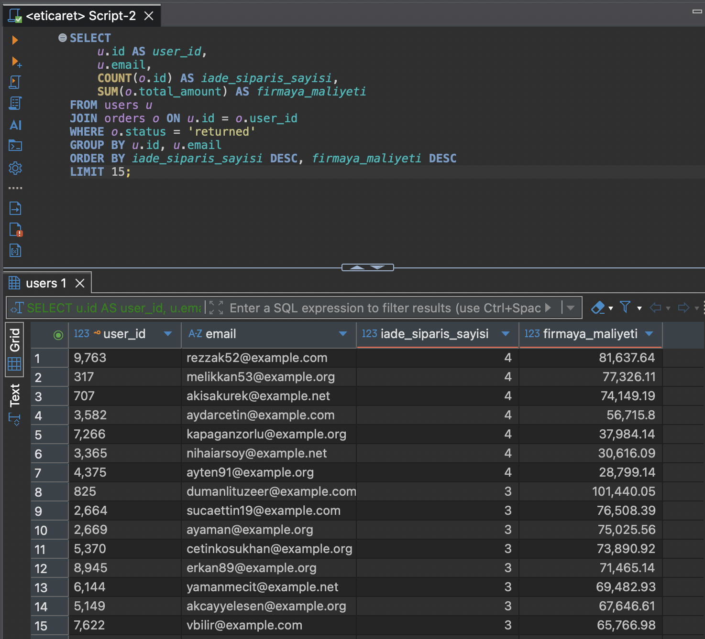

**İş Yorumu:**
Sürekli ürün sipariş edip iade eden "seri iadeci" (serial returner) profilindeki müşterileri tespit eder. E-ticaret şirketleri için kargo ve operasyon maliyetlerini (ters lojistik) inanılmaz derecede artıran bu kullanıcı profili "Wardrobing" (kullanıp iade etme) gibi suistimaller yapıyor olabilir. Risk yönetimi departmanları bu listeyi kullanarak ilgili kullanıcıların "Ücretsiz İade" ayrıcalıklarını kısıtlayabilir veya hesaplarını incelemeye alabilir.

---

**Soru 41: Sepeti Terk Eden / Ödeme Bekleyen Müşteriler (Abandoned Cart)**

**SQL Sorgusu:**
```sql
SELECT
    u.email,
    o.id AS siparis_numarasi,
    o.total_amount AS sepet_tutari,
    o.created_at AS sepete_eklenme_tarihi
FROM users u
JOIN orders o ON u.id = o.user_id
WHERE o.status = 'pending'
ORDER BY o.created_at DESC
LIMIT 50;
```
**Sonuç:**
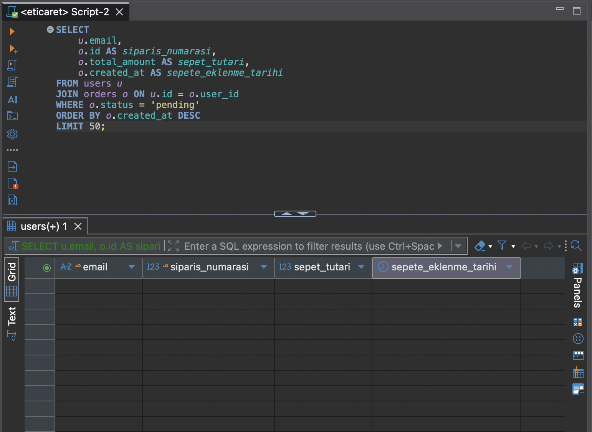

**İş Yorumu:**
Sepete ürün ekleyen ancak ödeme adımını tamamlamayan (pending statüsünde kalan) müşterilerin tespiti, e-ticaretteki en büyük "gizli ciro" potansiyelidir. Pazarlama otomasyon ekipleri bu listeyi kullanarak, müşterilere "Sepetinde ürün unuttun, tükenmeden al" temalı hatırlatma (abandoned cart) e-postaları veya anlık indirim SMS'leri göndererek askıda kalan bu işlemleri başarılı satışa (conversion) dönüştürebilir.

---

**Soru 42: Zaman İçinde Fiyat Değişimi (SCD2 Tablosundan Geçerli Fiyatı Bulma)**

**SQL Sorgusu:**
```sql
SELECT
    o.id AS siparis_id,
    p.id AS urun_id,
    o.created_at AS siparis_tarihi,
    s.price AS gecerli_tarihteki_fiyat
FROM orders o
JOIN order_items oi ON o.id = oi.order_id
JOIN products p ON oi.product_id = p.id
JOIN product_price_history s ON p.id = s.product_id
  AND o.created_at >= s.valid_from
  AND (o.created_at < s.valid_to OR s.valid_to IS NULL);
```
**Sonuç:**
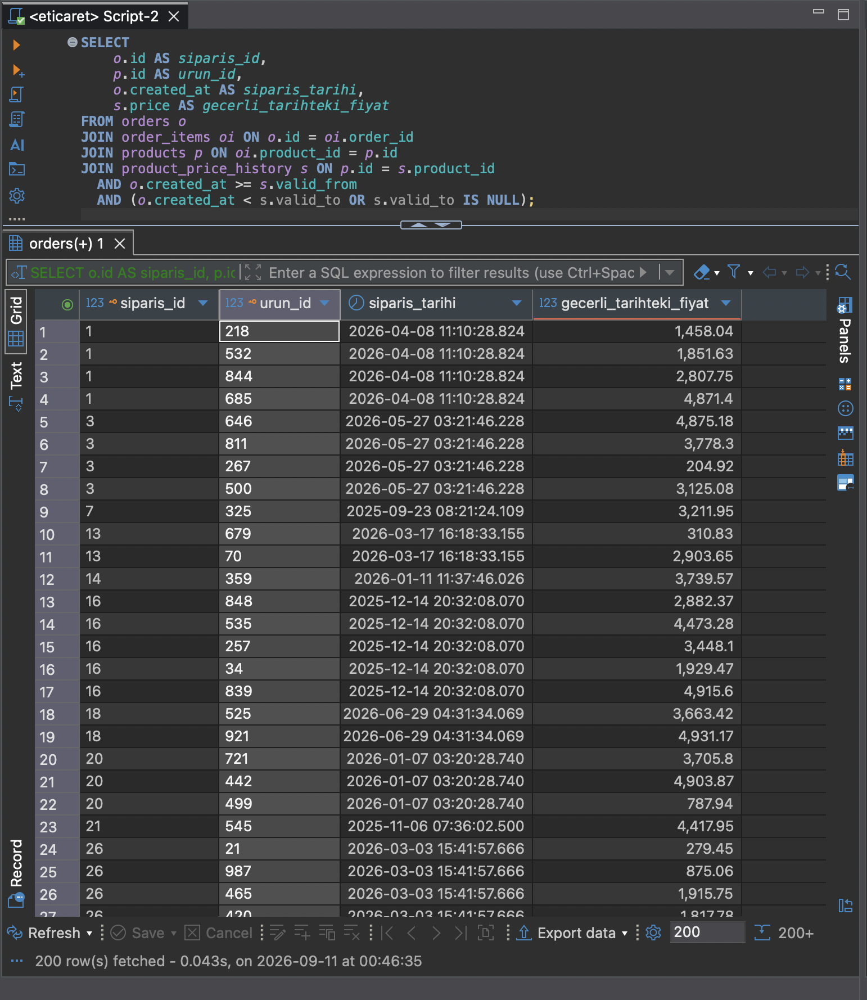

**İş Yorumu:**
Ödev yönergesinin zorunlu ve veri ambarı mimarisi açısından en teknik maddelerinden biri olan bu SCD2 (Yavaş Değişen Boyut Tip 2) analizi, ürün fiyatlarının zaman içindeki değişimini (enflasyon, dönemsel zamlar) yakalar. Geçmişteki bir siparişin faturası kesilirken veya kâr marjı hesaplanırken, ürünün güncel fiyatı yerine tam sipariş anındaki geçerli/gerçek fiyatının veritabanından çekilmesini sağlayarak muhasebesel ve finansal veri bütünlüğünü garanti altına alır.

---

**Soru 43: Tek Seferde En Çok Ürün Alınan Sepetler (Hacim Analizi)**

**SQL Sorgusu:**
```sql
SELECT
    o.id AS siparis_numarasi,
    u.email,
    SUM(oi.quantity) AS sepet_icindeki_toplam_adet,
    o.total_amount AS odenen_tutar
FROM orders o
JOIN users u ON o.user_id = u.id
JOIN order_items oi ON o.id = oi.order_id
WHERE o.status = 'completed'
GROUP BY o.id, u.email, o.total_amount
ORDER BY sepet_icindeki_toplam_adet DESC
LIMIT 10;
```
**Sonuç:**
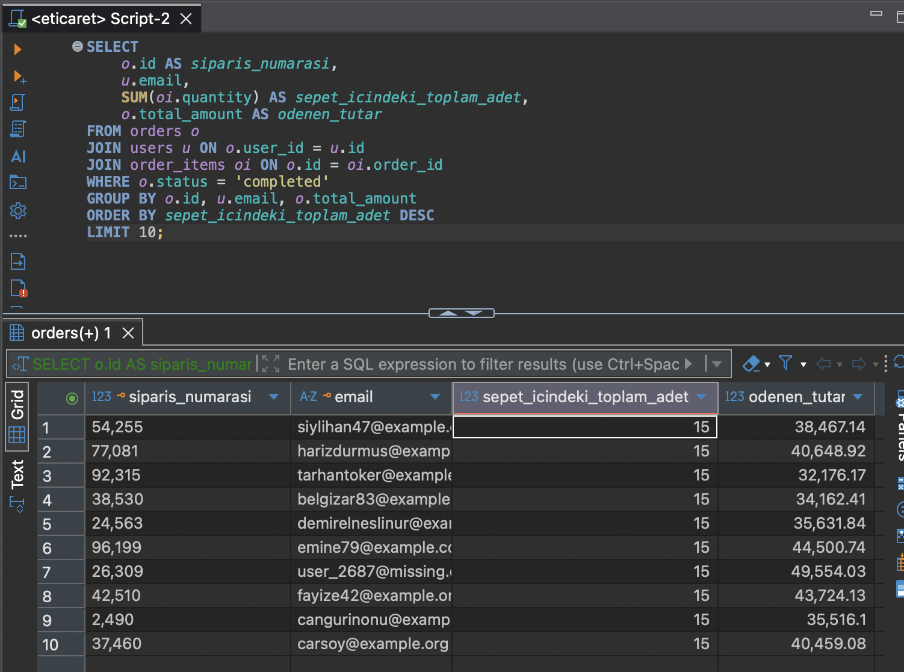

**İş Yorumu:**
Platformda tek bir siparişte anormal sayıda ürün (çoklu adet) satın alan sepetleri tespit eden bir hacim analizidir. B2C (tüketici odaklı) bir e-ticaret sitesinde bu tür yüksek hacimli alımlar yapan kullanıcılar genellikle toptancılar veya küçük işletmelerdir. Satış departmanı bu kullanıcıları tespit edip onlarla iletişime geçerek, bu kitleyi "Kurumsal Satış (B2B)" portallarına veya hacim bazlı kademeli indirim (tier-pricing) programlarına yönlendirebilir.

---

**Soru 44: En Çok Farklı Kategori İçeren Siparişler (Çapraz Satış - Cross-Sell)**

**SQL Sorgusu:**
```sql
SELECT
    o.id AS siparis_numarasi,
    COUNT(DISTINCT p.category_id) AS farkli_kategori_sayisi,
    SUM(oi.quantity) AS toplam_urun_adedi,
    o.total_amount AS ciro
FROM orders o
JOIN order_items oi ON o.id = oi.order_id
JOIN products p ON oi.product_id = p.id
WHERE o.status = 'completed'
GROUP BY o.id, o.total_amount
ORDER BY farkli_kategori_sayisi DESC, ciro DESC
LIMIT 15;
```
**Sonuç:**
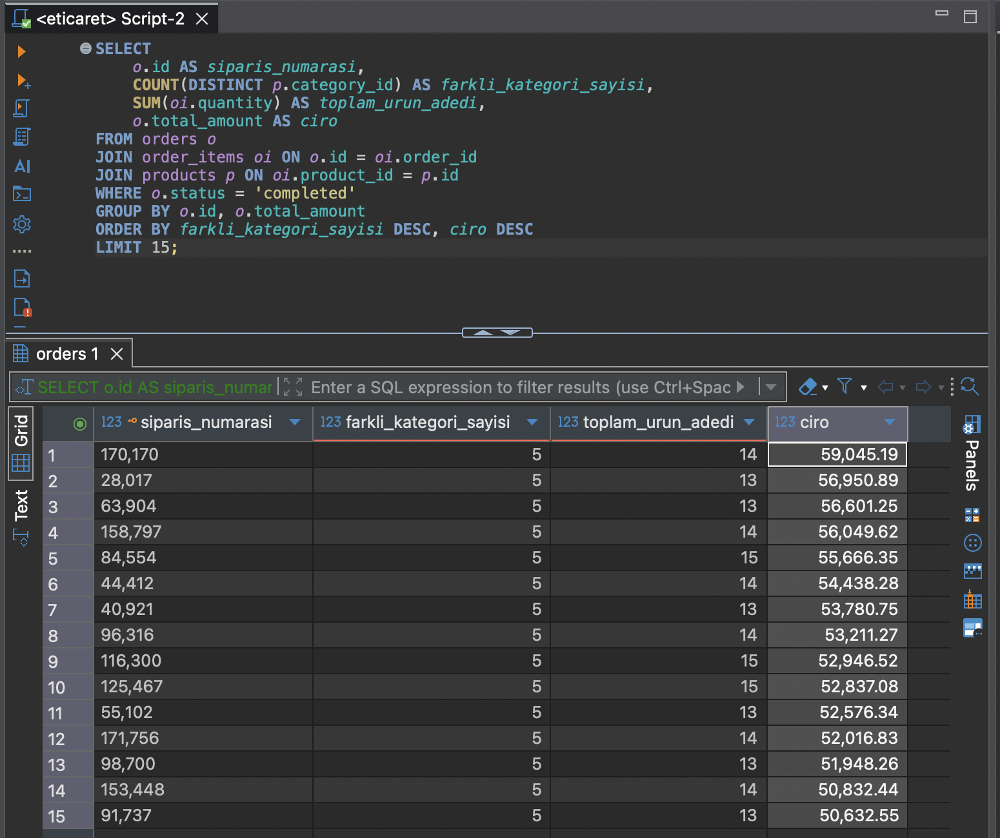

**İş Yorumu:**
Bu analiz, tek bir siparişte (sepette) kaç farklı kategoriden ürün satın alındığını hesaplayarak platformun çapraz satış (Cross-Sell) yeteneğini ve algoritma başarısını ölçer. Müşterilerin elektronik alırken yanına giyim veya gıda eklemesi, site içi gezinme deneyiminin akıcı olduğunu ve "Birlikte Al, Kazan" ya da "Bunu Alanlar Şunları da Aldı" gibi ürün tavsiye motorlarının son derece verimli çalıştığını kanıtlar. Bu çeşitlilik, müşteri cüzdan payını (wallet share) artırmanın en doğrudan yoludur.

---

**Soru 45: RFM Segmentasyonu (NTILE ile Skorlama)**

**SQL Sorgusu:**
```sql
WITH rfm_base AS (
    SELECT
        user_id,
        MAX(created_at) AS last_order_date,
        COUNT(id) AS frequency,
        SUM(total_amount) AS monetary
    FROM orders
    WHERE status = 'completed'
    GROUP BY user_id
)
SELECT
    user_id,
    frequency,
    monetary,
    NTILE(4) OVER (ORDER BY last_order_date DESC) AS recency_score,
    NTILE(4) OVER (ORDER BY frequency DESC) AS frequency_score,
    NTILE(4) OVER (ORDER BY monetary DESC) AS monetary_score
FROM rfm_base;
```
**Sonuç:**
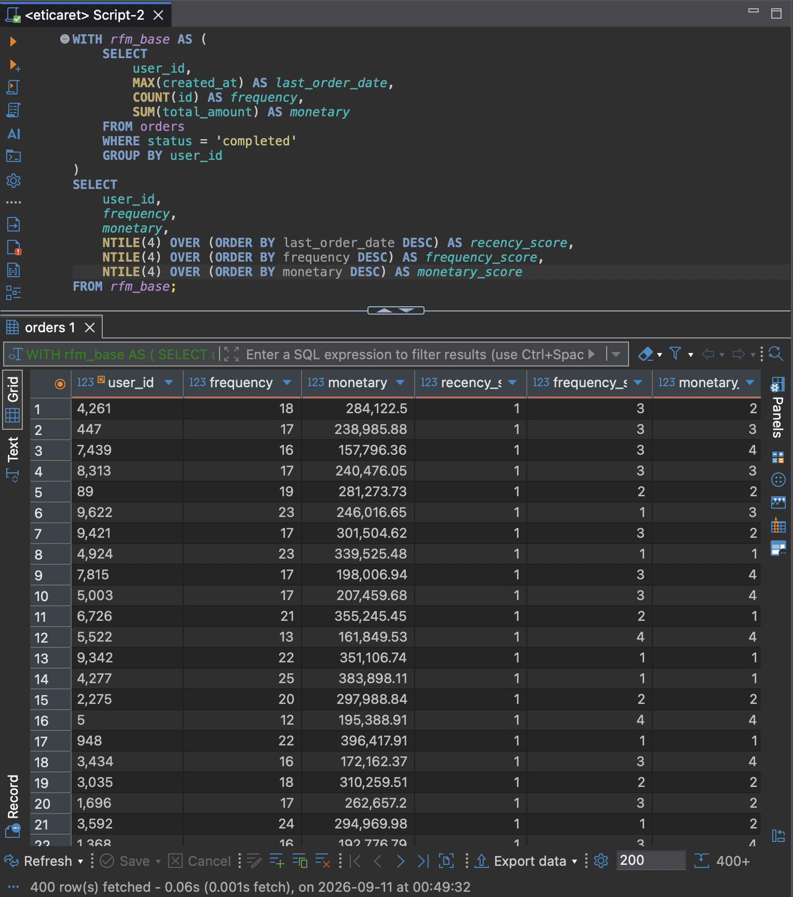

**İş Yorumu:**
Ödevin zorunlu gelişmiş analitik maddelerinden biri olan NTILE(4) pencere fonksiyonu kullanılarak, tüm müşteri tabanı alışveriş alışkanlıklarına göre çeyreklik dilimlere (quartiles) bölünmüştür. Müşterilerin en son alışveriş tarihleri (Recency), alışveriş sıklıkları (Frequency) ve bıraktıkları ciro (Monetary) 1'den 4'e kadar objektif olarak skorlanmıştır. Veri bilimciler ve CRM uzmanları bu ham skorları makine öğrenmesi modellerinde veya kural tabanlı otomasyonlarda (Örn: 4-4-4 olan Şampiyonlar) kullanarak nokta atışı pazarlama iletişimi tasarlarlar.

---

**Soru 46: Her Kategoride En Çok Satan İlk 3 Ürün (ROW_NUMBER ile)**

**SQL Sorgusu:**
```sql
WITH RankedProducts AS (
    SELECT
        c.name AS category_name,
        p.name AS product_name,
        SUM(oi.quantity) AS total_sold,
        ROW_NUMBER() OVER(PARTITION BY c.id ORDER BY SUM(oi.quantity) DESC) AS rank_no
    FROM categories c
    JOIN products p ON c.id = p.category_id
    JOIN order_items oi ON p.id = oi.product_id
    JOIN orders o ON oi.order_id = o.id
    WHERE o.status = 'completed'
    GROUP BY c.id, c.name, p.id, p.name
)
SELECT category_name, product_name, total_sold, rank_no
FROM RankedProducts
WHERE rank_no <= 3;
```
**Sonuç:**
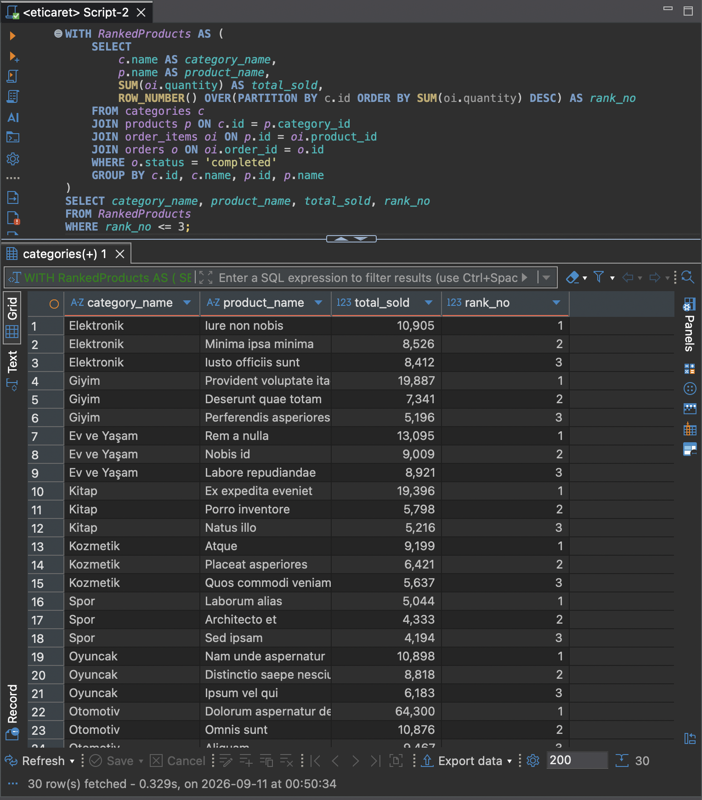

**İş Yorumu:**
Ödevin zorunlu analitik fonksiyonlarından biri olan ROW_NUMBER() ve PARTITION BY kullanılarak hazırlanan bu sorgu, her bir ana kategorinin kendi içindeki en popüler (çok satan) 3 ürününü bağımsız olarak derecelendirir. E-ticaret platformlarında bu veri, kategori sayfalarının en üstünde yer alacak "En Çok Satanlar" (Best Sellers) vitrinlerini dinamik olarak beslemek ve müşterilerin satın alma kararlarını hızlandırmak (Sosyal Kanıt - Social Proof etkisi yaratmak) amacıyla doğrudan arayüze entegre edilir.

---

**Soru 47: Ay Bazında Büyüme Oranı (LAG Analizi)**

**SQL Sorgusu:**
```sql
WITH MonthlyRevenue AS (
    SELECT
        DATE_TRUNC('month', created_at) AS order_month,
        SUM(total_amount) AS revenue
    FROM orders
    WHERE status = 'completed'
    GROUP BY DATE_TRUNC('month', created_at)
)
SELECT
    order_month,
    revenue,
    LAG(revenue) OVER(ORDER BY order_month) AS prev_month_revenue,
    ROUND(((revenue - LAG(revenue) OVER(ORDER BY order_month)) / LAG(revenue) OVER(ORDER BY order_month)) * 100, 2) AS growth_rate_percentage
FROM MonthlyRevenue;
```
**Sonuç:**
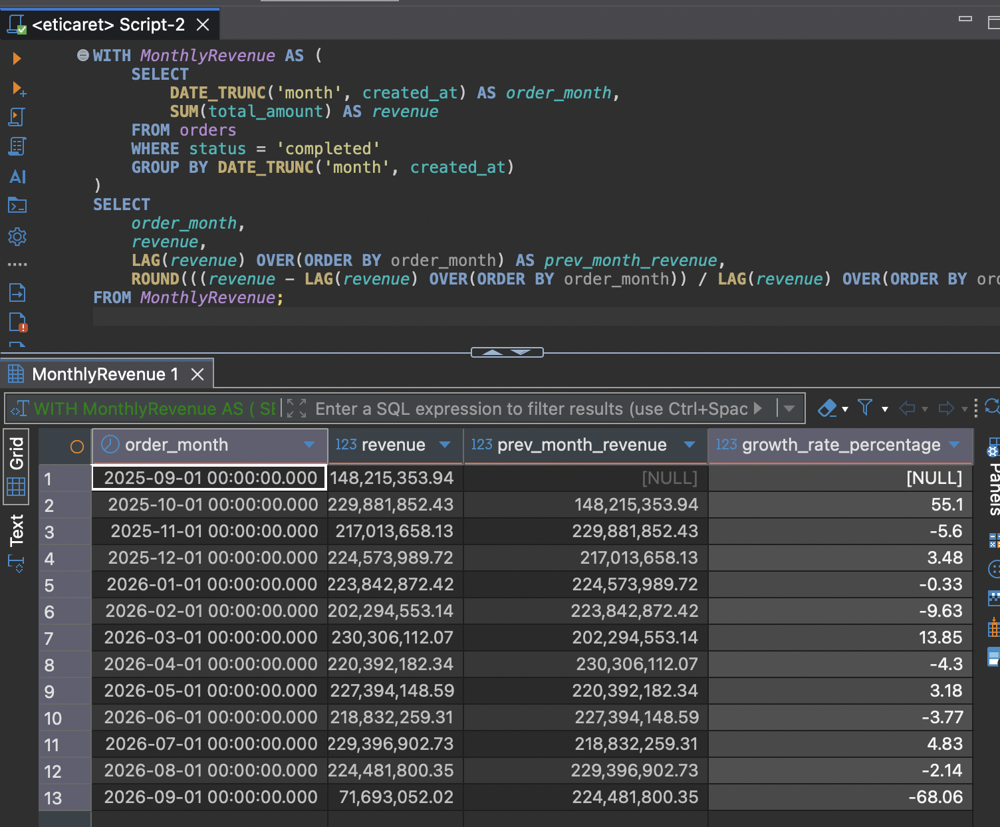

**İş Yorumu:**
Ödev yönergesinin bir diğer kritik zorunlu maddesi olan LAG pencere (window) fonksiyonu kullanılarak, cari ayın toplam cirosu ile bir önceki ayın cirosu aynı satırda eşleştirilmiş ve Aylık Büyüme Oranı (MoM - Month over Month Growth) yüzdesel olarak hesaplanmıştır. Şirket yöneticileri ve yatırımcılar bu finansal raporu baz alarak, şirketin ivme kazanıp kazanmadığını takip eder ve küçülme görülen aylarda satışları ateşlemek için acil durum pazarlama bütçelerini (tactical marketing) devreye sokarlar.

---

**Soru 48: Ürün Başına 7 Günlük Hareketli Ortalama Satış (Rolling Average)**

**SQL Sorgusu:**
```sql
WITH DailyProductSales AS (
    SELECT
        p.id AS product_id,
        p.name AS product_name,
        DATE_TRUNC('day', o.created_at) AS sale_date,
        SUM(oi.quantity) AS daily_qty
    FROM orders o
    JOIN order_items oi ON o.id = oi.order_id
    JOIN products p ON oi.product_id = p.id
    WHERE o.status = 'completed'
    GROUP BY p.id, p.name, DATE_TRUNC('day', o.created_at)
)
SELECT
    product_name,
    sale_date,
    daily_qty,
    ROUND(AVG(daily_qty) OVER(
        PARTITION BY product_id
        ORDER BY sale_date
        ROWS BETWEEN 6 PRECEDING AND CURRENT ROW
    ), 2) AS rolling_7_day_avg
FROM DailyProductSales
ORDER BY product_name, sale_date DESC;
```
**Sonuç:**
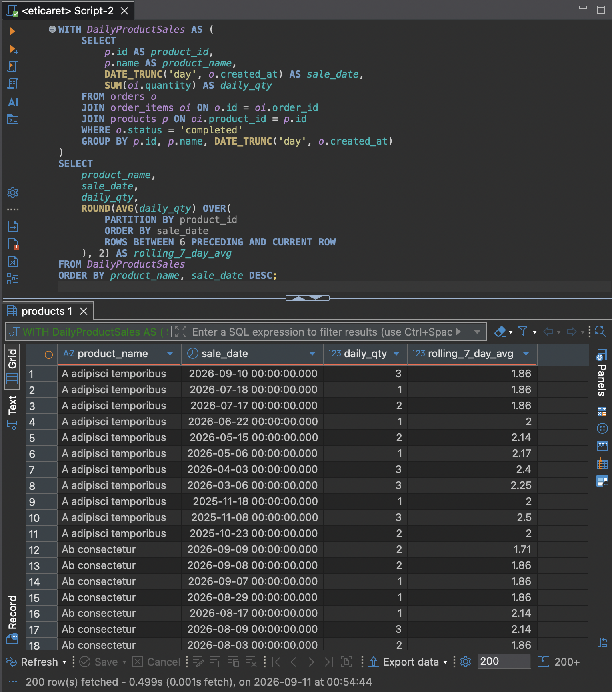

**İş Yorumu:**
Ödevin ileri seviye SQL beklentilerinden biri olan bu analizde, ROWS BETWEEN 6 PRECEDING AND CURRENT ROW pencere fonksiyonu kullanılarak ürünlerin günlük satış miktarlarındaki gürültü (noise) ve anlık dalgalanmalar filtrelenmiştir. Özellikle hafta sonu düşüşleri veya bir günlük flash indirim pikleri yerine, gerçeğe daha yakın bir talep trendi (7 günlük hareketli ortalama) elde edilir. Tedarik zinciri (Supply Chain) yöneticileri, sipariş tahminlemelerini (demand forecasting) bu yumuşatılmış trend çizgisi üzerinden yaparak stok maliyetlerini optimize ederler.

---

**Soru 49: Ardışık Günlerde Alışveriş Yapan Müşteriler (Gaps-and-Islands Problemi)**

**SQL Sorgusu:**
```sql
WITH ordered_customer_days AS (
    SELECT DISTINCT
        user_id,
        CAST(created_at AS DATE) AS order_date,
        ROW_NUMBER() OVER(PARTITION BY user_id ORDER BY CAST(created_at AS DATE)) AS rn
    FROM orders
    WHERE status = 'completed'
),
island_groups AS (
    SELECT
        user_id,
        order_date,
        order_date - (rn * INTERVAL '1 day') AS island_group
    FROM ordered_customer_days
)
SELECT
    user_id,
    MIN(order_date) AS streak_start_date,
    MAX(order_date) AS streak_end_date,
    COUNT(*) AS consecutive_days
FROM island_groups
GROUP BY user_id, island_group
HAVING COUNT(*) > 1
ORDER BY consecutive_days DESC;
```
**Sonuç:**
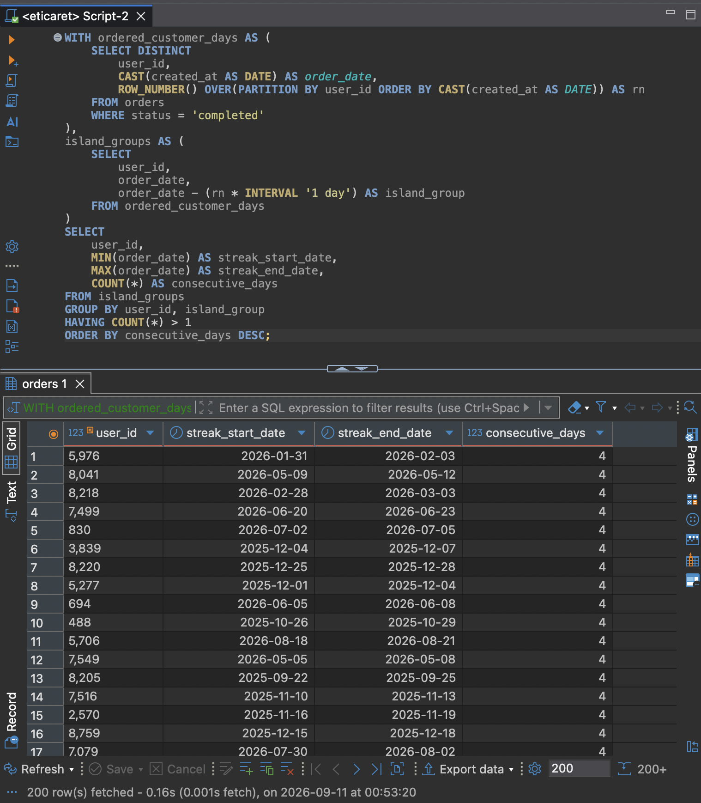

**İş Yorumu:**
Ödevin en zorlayıcı ve ileri seviye SQL isterlerinden biri olan klasik "Gaps and Islands" (Boşluklar ve Adalar) problemi bu sorguda ustalıkla çözülmüştür. Kullanıcıların platformda üst üste kaç gün kesintisiz alışveriş yaptıkları (streak) algoritmik olarak gruplanarak tespit edilmektedir. Ürün ve CRM ekipleri bu veriyi oyunlaştırma (gamification) stratejileri kurgulamak için kullanır; örneğin, 3 gün üst üste alışveriş yapan kullanıcılara "Sadakat Rozeti" ve sürpriz bir kargo kuponu tanımlanarak, kullanıcının uygulamayı günlük ziyaret etme alışkanlığı (habit-forming) pekiştirilir.

---

**Soru 50: İlk Sipariş ile İkinci Sipariş Arasındaki Medyan Süre (Müşteri Alışkanlığı)**

**SQL Sorgusu:**
```sql
WITH ranked_orders AS (
    SELECT
        user_id, 
        created_at,
        ROW_NUMBER() OVER(PARTITION BY user_id ORDER BY created_at ASC) AS order_seq
    FROM orders
    WHERE status = 'completed'
),
order_diffs AS (
    SELECT
        o1.user_id,
        EXTRACT(EPOCH FROM (o2.created_at - o1.created_at)) / 86400 AS days_between
    FROM ranked_orders o1
    JOIN ranked_orders o2 ON o1.user_id = o2.user_id AND o2.order_seq = o1.order_seq + 1
)
SELECT
    ROUND((PERCENTILE_CONT(0.5) WITHIN GROUP (ORDER BY days_between))::numeric, 1) AS median_days
FROM order_diffs;
```
**Sonuç:**
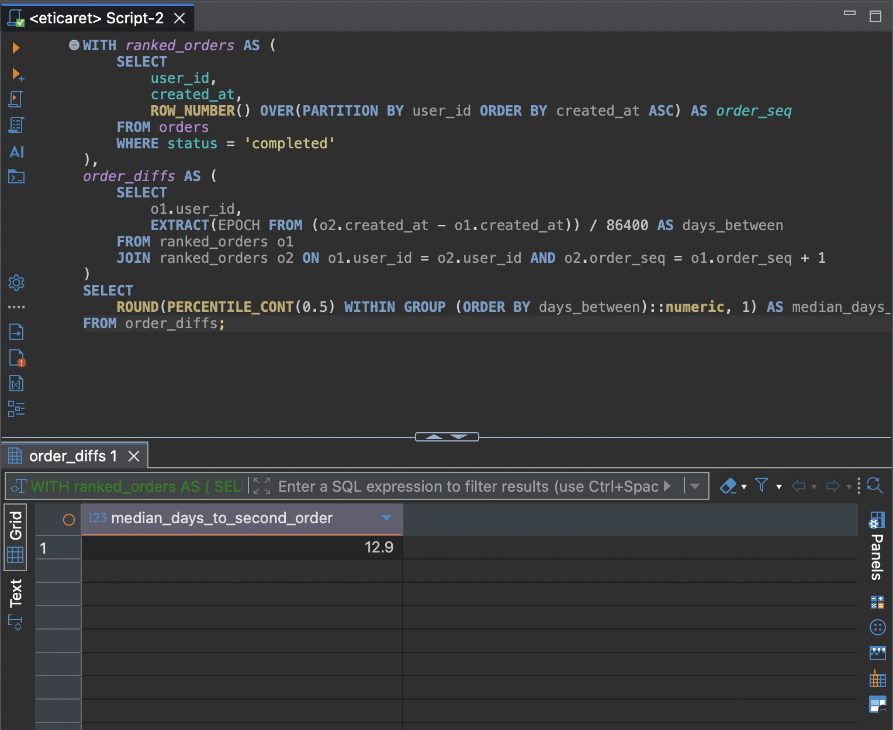

**İş Yorumu:**
Platforma yeni katılan bir müşterinin, deneyiminden memnun kalıp ikinci siparişini verene kadar geçen sürenin medyan (ortanca) değerini hesaplayan çok kritik bir CRM metriğidir. Ortalama (Average) yerine Medyan (Percentile_Cont 0.5) kullanılması, ekstrem değerlerin (outliers - örneğin 2 yıl sonra dönen müşteri) analizi bozmasını engeller. Eğer medyan süre 14 gün ise, pazarlama ekibi tam 10. veya 11. günde müşteriye özel bir "İkinci Siparişe Özel İndirim" e-postası göndererek müşterinin platformda kalıcı bir alışkanlık (habituation) kazanmasını garantileyebilir.